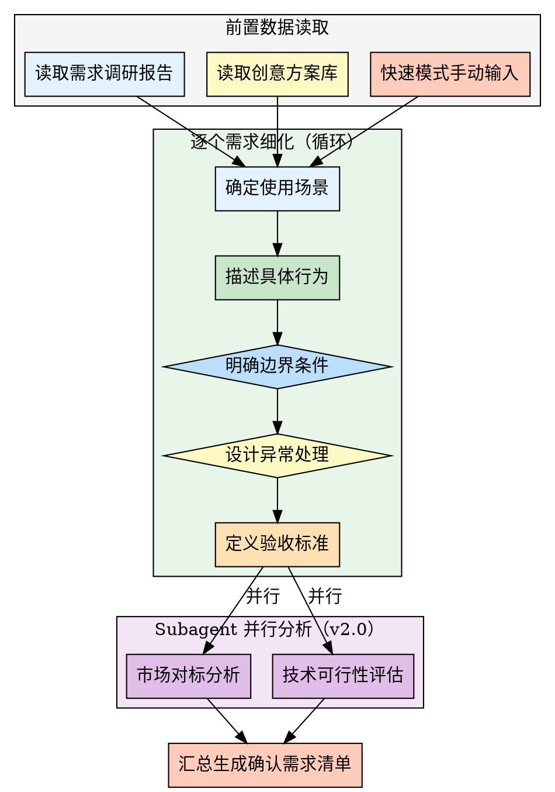

## Preamble (run first)

```bash
bash "$(dirname "${BASH_SOURCE[0]}")"/check-update.sh 2>/dev/null || true
# 创建需求调研目录
mkdir -p docs/01-需求调研

# 检查是否有需求调研报告
if [ ! -f "docs/01-需求调研/需求调研报告.md" ]; then
  echo "⚠️  未找到需求调研报告"
  echo ""
  echo "建议先执行 /pm-demand 完成需求调研"
  echo ""
  echo "您可以选择："
  echo "A) 执行 /pm-demand 先完成需求调研（推荐）"
  echo "B) 手动输入需求列表（快速模式）"
fi
```

---

## 执行流程



### 步骤 1: 读取前置数据

**如果有需求调研报告**：

使用 Read 工具读取 `docs/01-需求调研/需求调研报告.md`

提取：
- 产品名称
- 目标用户
- 核心痛点
- 初步需求清单

**如果有创意方案库**：

使用 Read 工具读取 `docs/01-需求调研/创意方案库.md`

提取：
- 核心创意方案

**如果没有前置文档**：

进入快速模式，使用 AskUserQuestion 收集需求列表：

> 📝 快速模式 - 请列出核心需求：
>
> 请逐个输入需求，每个需求一行：
> 例如：
> - 快速下单
> - 订单追踪
> - 会员体系
>
> 输入"完成"结束

---

### 步骤 2: 逐个细化需求

**关键原则**：
- 一次只细化一个需求
- 明确使用场景
- 明确边界条件
- 明确验收标准

---

对每个需求，AI 询问以下问题：

**问题 1: 使用场景**

> 需求"{需求名称}"的使用场景是什么？
>
> A) 用户首次使用时
> B) 用户日常使用时
> C) 用户遇到特定问题时
> D) 用户完成特定任务后
> E) 其他（请手动输入）

记录到变量 `SCENARIO`

---

**问题 2: 具体行为**

> 用户在这个场景下具体要做什么？
>
> 例如："用户打开APP，选择商品，点击立即购买，完成支付"
>
> 请描述具体步骤：

用户描述后，AI 整理成流程步骤。

---

**问题 3: 边界条件**

> 这个需求的边界条件是什么？
>
> A) 时间限制 - 如"订单30分钟内未支付自动取消"
> B) 数量限制 - 如"每个用户最多创建10个项目"
> C) 权限限制 - 如"仅会员可使用"
> D) 状态限制 - 如"仅未完成的订单可修改"
> E) 其他（请手动输入）

记录到变量 `BOUNDARY_CONDITIONS`

---

**问题 4: 异常处理**

> 如果出现异常情况，如何处理？
>
> A) 提示用户并引导解决
> B) 自动重试或降级处理
> C) 记录日志并通知管理员
> D) 回滚操作并提示失败
> E) 其他（请手动输入）

记录到变量 `EXCEPTION_HANDLING`

---

**问题 5: 验收标准**

> 这个需求的验收标准是什么？
>
> 例如："用户能在3步内完成下单，支付成功率>95%"
>
> 请描述可衡量的标准：

用户描述后，记录到变量 `ACCEPTANCE_CRITERIA`

---

### 步骤 3: 汇总细化结果

AI 将每个需求的细化信息整理成结构化格式。

---

### 步骤 4: 生成确认需求清单

使用 Write 工具创建 `docs/01-需求调研/确认需求清单.md`：

```markdown
# 确认需求清单

## 一、基础信息

- **产品名称**: {PRODUCT_NAME}
- **目标用户**: {TARGET_USER}
- **生成时间**: {当前时间}

---

## 二、需求详情

### 需求 1: {需求名称}

**使用场景**:
{SCENARIO}

**具体步骤**:
1. {步骤1}
2. {步骤2}
3. {步骤3}

**边界条件**:
{BOUNDARY_CONDITIONS}

**异常处理**:
{EXCEPTION_HANDLING}

**验收标准**:
{ACCEPTANCE_CRITERIA}

**优先级**: 待定（需通过 /pm-priority 确定）

---

### 需求 2: {需求名称}

**使用场景**:
{SCENARIO}

**具体步骤**:
1. {步骤1}
2. {步骤2}

**边界条件**:
{BOUNDARY_CONDITIONS}

**异常处理**:
{EXCEPTION_HANDLING}

**验收标准**:
{ACCEPTANCE_CRITERIA}

**优先级**: 待定

---

## 三、需求汇总表

| 序号 | 需求名称 | 场景 | 边界条件 | 验收标准 | 状态 |
|------|----------|------|----------|----------|------|
| 1 | {需求1} | {场景简述} | {边界简述} | {标准简述} | ✅ 已细化 |
| 2 | {需求2} | {场景简述} | {边界简述} | {标准简述} | ✅ 已细化 |

---

## 四、下一步建议

建议执行：

1. **/pm-market** - 市场分析，了解竞品和市场规模（推荐）
2. **/pm-priority** - 优先级排序，决定先做哪个需求
3. **/pm-mvp** - MVP规划，确定第一版要做什么

---

**项目状态**: 需求细化完成
**生成时间**: {时间戳}
**生成工具**: super-pm v2.0.0
```

---

### 步骤 5: 输出完成提示

使用 AskUserQuestion 提供下一步选项：

> ✅ 需求细化完成！
>
> 📄 确认需求清单已生成：`docs/01-需求调研/确认需求清单.md`
>
> 🎯 建议下一步：
>
> A) 执行 /pm-market - 市场分析，了解竞品和市场规模（推荐）
> B) 执行 /pm-priority - 优先级排序，决定需求优先级
> C) 执行 /pm-mvp - MVP规划，确定第一版功能
> D) 查看确认需求清单

---

## Subagent 并行分析（v2.0 新增）

在需求细化完成后，可派发 subagent 并行进行外部验证：

**Agent 1: 市场对标分析**
```
type: "general-purpose"
prompt: "搜索与当前产品对标的市场同类功能详情，提供参考标准..."
```

**Agent 2: 技术可行性评估**
```
type: "general-purpose"
prompt: "评估各需求的技术实现难度和备选方案..."
```

## V1 vs V2 对比

| 维度 | v1（串行） | v2（Subagent 并行） |
|------|-----------|-------------------|
| 外部验证 | 手动搜索或跳过 | Subagent 并行搜索分析 |
| Token 占用 | 搜索结果占主上下文 | Subagent 独立处理 |
| 执行效率 | 线性顺序 | 并行 2x 加速 |

---

## 兜底机制

### 场景 1: 无需求调研报告

提供快速模式，允许用户手动输入需求列表。

提示：
> ⚠️ 未找到需求调研报告
>
> 您可以选择：
> A) 执行 /pm-demand 先完成需求调研（推荐）
> B) 手动输入需求列表（快速模式）

### 场景 2: 需求数量过多

如果需求数量 > 10，询问用户：

> ⚠️ 检测到 {N} 个需求，细化可能需要较长时间
>
> 您可以选择：
> A) 细化所有需求
> B) 仅细化核心需求（前5个）
> C) 我来选择要细化的需求

---

## 注意事项

1. **一次一个需求**：避免用户负担过重
2. **结构化问题**：场景、步骤、边界、异常、验收标准
3. **边界条件重要**：明确限制，避免后期返工
4. **验收标准可量化**：便于后续测试和验收
5. **Markdown存储**：需求清单人类可读可编辑

---

## 输出质量对比

**✅ Good 示例**：
```
- 有数据引用：「根据 Q4 数据，留存率从 35% 降至 28%」
- 有验证来源：「数据来源：Google Analytics, 2025-12-01」
- 有明确建议：「建议将新手引导步骤从 5 步减少至 3 步」
```

**❌ Bad 示例**：
```
- 模糊结论：「数据表明留存率有所下降」
- 无来源：「根据经验，这个功能很重要」
- 没有行动建议：「留存是个问题」
```

---

## 常见误区 / Red Flags — STOP

出现以下情况立即停止并回溯：

| 误区 | 正确做法 |
|------|---------|
| 使用"应该"、"大概"、"看起来"做结论 | 必须基于实际数据和验证 |
| 未运行检查就声称已完成 | 先验证，再陈述 |
| 因时间紧迫跳过关键步骤 | 没有例外，时间紧更要严格 |
| "这次应该没问题"的想法 | 每次都要重新验证 |

---

## 产出质量检查 / Verification Checklist

- [ ] 前置依赖已满足（输入文档/数据已收集）
- [ ] 核心步骤已全部执行
- [ ] 输出文档已生成到 `docs/` 目录
- [ ] 每个判断都有数据/证据支撑
- [ ] 已推荐 2-3 个后续 skill

> ⚠️ 任何一项未通过 → 补全后再标记完成。

---
