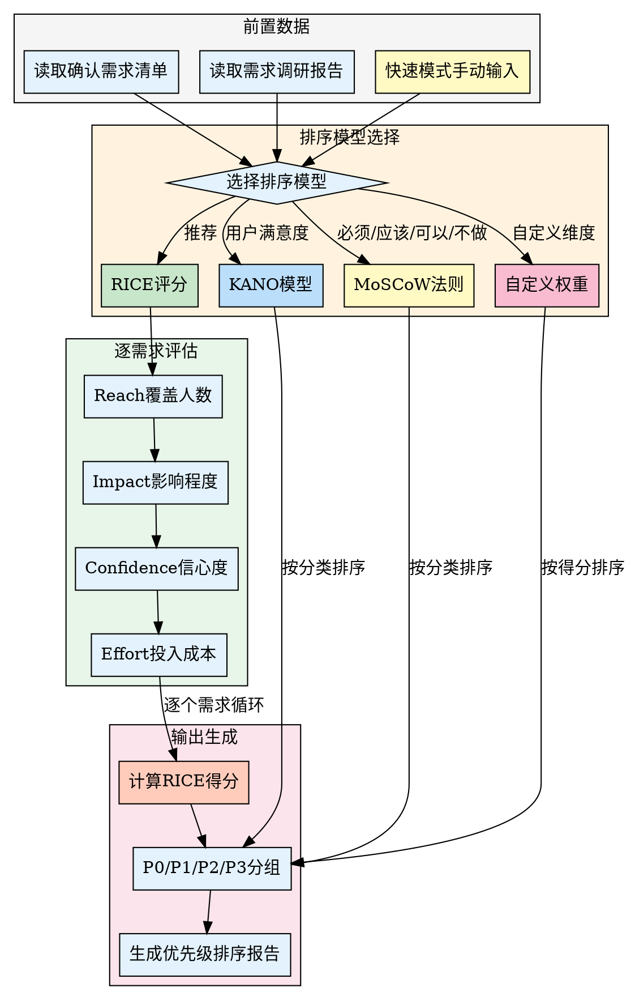

## Preamble (run first)

```bash
bash "$(dirname "${BASH_SOURCE[0]}")"/check-update.sh 2>/dev/null || true
# 创建需求调研目录
mkdir -p docs/01-需求调研

# 检查是否有确认需求清单
if [ ! -f "docs/01-需求调研/确认需求清单.md" ]; then
  echo "⚠️  未找到确认需求清单"
  echo ""
  echo "建议先执行 /pm-clarify 细化需求"
  echo ""
  echo "您可以选择："
  echo "A) 执行 /pm-clarify 先细化需求（推荐）"
  echo "B) 手动输入需求列表（快速模式）"
  echo "C) 从需求池导入（执行过 /pm-pool）"
fi
```

---

## 执行流程



### 步骤 1: 读取前置数据

**如果有确认需求清单**：

使用 Read 工具读取 `docs/01-需求调研/确认需求清单.md`

提取需求列表。

**如果有需求调研报告**：

使用 Read 工具读取 `docs/01-需求调研/需求调研报告.md`

提取初步需求列表。

**如果没有前置文档**：

进入快速模式，使用 AskUserQuestion 收集需求列表。

---

### 步骤 2: 选择排序模型

使用 AskUserQuestion 询问：

> 🎯 选择需求优先级排序模型：
>
> A) RICE评分 - 综合Reach、Impact、Confidence、Effort（推荐）
> B) KANO模型 - 基于用户满意度分类需求
> C) MoSCoW法则 - Must/Should/Could/Won't分类
> D) 自定义权重 - 自定义评分维度

用户选择后，记录到变量 `PRIORITY_MODEL`

---

### 步骤 3: 执行优先级评估

---

#### 如果选择 RICE 评分：

对每个需求，AI 询问：

**问题 1: Reach（覆盖人数）**

> 需求"{需求名称}"预计影响多少用户？
>
> A) 全部用户（100%）
> B) 大部分用户（50-80%）
> C) 部分用户（20-50%）
> D) 少量用户（<20%）

**评分规则**：
- A = 10分
- B = 7分
- C = 5分
- D = 3分

---

**问题 2: Impact（影响程度）**

> 这个需求对业务目标的影响程度？
>
> A) 极大影响 - 直接影响核心指标
> B) 较大影响 - 显著提升指标
> C) 中等影响 - 有一定提升
> D) 较小影响 - 影响有限

**评分规则**：
- A = 10分
- B = 7分
- C = 5分
- D = 3分

---

**问题 3: Confidence（信心度）**

> 对这个需求的信心如何？
>
> A) 非常有信心 - 有数据或调研支持
> B) 较有信心 - 有一定依据
> C) 中等信心 - 基于假设
> D) 信心不足 - 猜测或不确定

**评分规则**：
- A = 10分
- B = 7分
- C = 5分
- D = 3分

---

**问题 4: Effort（投入成本）**

> 实现这个需求需要多少工作量？
>
> A) 很小 - 1-2人天
> B) 较小 - 3-5人天
> C) 中等 - 1-2人周
> D) 较大 - 2-4人周
> E) 很大 - >1人月

**评分规则**：
- A = 10分
- B = 8分
- C = 5分
- D = 3分
- E = 1分

---

**RICE 得分计算**：

```
RICE得分 = (Reach × Impact × Confidence) / Effort
```

AI 自动计算每个需求的 RICE 得分。

---

#### 如果选择 KANO 模型：

对每个需求，AI 询问：

> 这个需求属于哪类？
>
> A) 基本型需求 - 必须有，没有用户会很不满意
> B) 期望型需求 - 越完善用户越满意
> C) 魅力型需求 - 没有没关系，有了会惊喜
> D) 无差异需求 - 有没有都无所谓
> E) 反向型需求 - 有了反而用户不满

AI 根据分类进行排序：
1. 基本型需求（最高优先级）
2. 期望型需求
3. 魅力型需求
4. 无差异需求
5. 反向型需求

---

#### 如果选择 MoSCoW 法则：

对每个需求，AI 询问：

> 这个需求的优先级？
>
> A) Must have - 必须有，否则产品无法使用
> B) Should have - 应该有，重要但非紧急
> C) Could have - 可以有，锦上添花
> D) Won't have - 本期不做，后续考虑

AI 根据分类进行排序。

---

### 步骤 4: 汇总优先级结果

AI 根据评分或分类，对所有需求进行排序。

---

### 步骤 5: 生成优先级排序报告

使用 Write 工具创建 `docs/01-需求调研/优先级排序报告.md`：

```markdown
# 优先级排序报告

## 一、基础信息

- **排序模型**: {PRIORITY_MODEL}
- **需求数量**: {N}个
- **生成时间**: {当前时间}

---

## 二、排序结果

### 2.1 需求优先级列表

| 排名 | 需求名称 | RICE得分 | Reach | Impact | Confidence | Effort | 优先级 |
|------|----------|----------|-------|--------|------------|--------|--------|
| 1 | {需求1} | {得分} | {R} | {I} | {C} | {E} | P0 |
| 2 | {需求2} | {得分} | {R} | {I} | {C} | {E} | P0 |
| 3 | {需求3} | {得分} | {R} | {I} | {C} | {E} | P1 |
| ... | ... | ... | ... | ... | ... | ... | ... |

### 2.2 优先级分组

**P0 - 核心需求（必须做）**:
1. {需求1} - RICE得分: {得分}
2. {需求2} - RICE得分: {得分}

**P1 - 重要需求（应该做）**:
1. {需求3} - RICE得分: {得分}
2. {需求4} - RICE得分: {得分}

**P2 - 次要需求（可以做）**:
1. {需求5} - RICE得分: {得分}

**P3 - 待定需求（暂缓）**:
1. {需求6} - RICE得分: {得分}

---

## 三、排序依据

### 3.1 RICE评分说明

**Reach（覆盖人数）**:
- 10分: 全部用户
- 7分: 大部分用户（50-80%）
- 5分: 部分用户（20-50%）
- 3分: 少量用户（<20%）

**Impact（影响程度）**:
- 10分: 极大影响
- 7分: 较大影响
- 5分: 中等影响
- 3分: 较小影响

**Confidence（信心度）**:
- 10分: 非常有信心
- 7分: 较有信心
- 5分: 中等信心
- 3分: 信心不足

**Effort（投入成本）**:
- 10分: 很小（1-2人天）
- 8分: 较小（3-5人天）
- 5分: 中等（1-2人周）
- 3分: 较大（2-4人周）
- 1分: 很大（>1人月）

**RICE得分 = (Reach × Impact × Confidence) / Effort**

得分越高，优先级越高。

---

## 四、实施建议

### 4.1 MVP范围建议

建议第一版（MVP）包含 P0 级需求，共 {N} 个需求：

1. {需求1}
2. {需求2}
3. ...

预计工作量: {估算}

### 4.2 后续迭代

**第二版（V1.1）**: P1级需求
**第三版（V1.2）**: P2级需求

---

## 五、下一步建议

建议执行：

1. **/pm-mvp** - MVP规划，确定第一版具体方案（推荐）
2. **/pm-docs** - 生成PRD文档
3. **/pm-pool** - 需求池管理，长期跟踪需求

---

**项目状态**: 优先级排序完成
**生成时间**: {时间戳}
**生成工具**: super-pm v1.0.0
```

---

### 步骤 6: 输出完成提示

使用 AskUserQuestion 提供下一步选项：

> ✅ 优先级排序完成！
>
> 📄 优先级排序报告已生成：`docs/01-需求调研/优先级排序报告.md`
>
> 🎯 建议下一步：
>
> A) 执行 /pm-mvp - MVP规划，确定第一版方案（推荐）
> B) 执行 /pm-docs - 生成PRD文档
> C) 执行 /pm-pool - 需求池管理
> D) 查看优先级排序报告

---

## 兜底机制

### 场景 1: 无需求清单

提供快速模式，允许手动输入需求列表。

### 场景 2: 需求数量过多

如果需求数量 > 15，询问用户：

> ⚠️ 需求数量较多（{N}个），评分可能需要较长时间
>
> 您可以选择：
> A) 全部评分
> B) 仅对核心需求评分（前10个）
> C) 我来选择要评分的需求

---

## 注意事项

1. **一次一个需求**：避免用户负担过重
2. **评分标准明确**：每个选项对应明确分数
3. **RICE计算自动**：AI自动计算得分
4. **优先级分组**：P0/P1/P2/P3便于后续决策
5. **Markdown存储**：排序报告人类可读可编辑

---

## 输出质量对比

**✅ Good 示例**：
```
- 有数据引用：「根据 Q4 数据，留存率从 35% 降至 28%」
- 有验证来源：「数据来源：Google Analytics, 2025-12-01」
- 有明确建议：「建议将新手引导步骤从 5 步减少至 3 步」
```

**❌ Bad 示例**：
```
- 模糊结论：「数据表明留存率有所下降」
- 无来源：「根据经验，这个功能很重要」
- 没有行动建议：「留存是个问题」
```

---

## 常见误区 / Red Flags — STOP

出现以下情况立即停止并回溯：

| 误区 | 正确做法 |
|------|---------|
| 使用"应该"、"大概"、"看起来"做结论 | 必须基于实际数据和验证 |
| 未运行检查就声称已完成 | 先验证，再陈述 |
| 因时间紧迫跳过关键步骤 | 没有例外，时间紧更要严格 |
| "这次应该没问题"的想法 | 每次都要重新验证 |

---

## 产出质量检查 / Verification Checklist

- [ ] 前置依赖已满足（输入文档/数据已收集）
- [ ] 核心步骤已全部执行
- [ ] 输出文档已生成到 `docs/` 目录
- [ ] 每个判断都有数据/证据支撑
- [ ] 已推荐 2-3 个后续 skill

> ⚠️ 任何一项未通过 → 补全后再标记完成。

---
