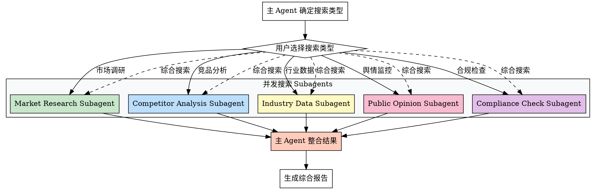

## Preamble (run first)

```bash
bash "$(dirname "${BASH_SOURCE[0]}")"/check-update.sh 2>/dev/null || true
# 创建需求调研目录
mkdir -p docs/01-需求调研

echo "🔍 PM-Search V2 - 联网搜索整合工具"
echo "支持并发搜索：市场调研 | 竞品分析 | 行业数据 | 舆情监控 | 合规检查"
echo ""
```

---

## 执行流程

### 步骤 1: 确定搜索类型（主 agent - 用户交互）

使用 AskUserQuestion 询问：

> 🔍 联网搜索整合工具 - 选择搜索类型
>
> 请选择您需要进行的研究类型（可多选）：
>
> A) 市场调研 - 市场规模、趋势、用户画像
> B) 竞品分析 - 竞品功能、定价、策略
> C) 行业数据 - 行业报告、统计数据
> D) 舆情监控 - 用户评价、媒体报道
> E) 合规检查 - 政策法规、行业标准
> F) 综合搜索 - 以上全部（并发执行）
> G) 其他（请手动输入）

**用户选择后，根据选择执行不同流程。**

---

## Subagent 并发搜索架构

### 架构图



---

### 步骤 2A: 单一类型搜索（主 agent 直接执行）

**如果用户选择单个搜索类型，直接执行：**

#### 市场调研

```markdown
使用 WebSearch 搜索：

搜索关键词："{产品领域} 市场规模 2026"
搜索关键词："{产品领域} 市场趋势"
搜索关键词："{产品领域} 用户画像"

数据源优先级：
1. 艾瑞咨询、易观分析、QuestMobile（权威报告）
2. 36氪、虎嗅（行业媒体）
3. 工信部、网信办（政策法规）

整合结果 → 生成：docs/01-需求调研/市场调研报告.md
```

#### 竞品分析

```markdown
使用 WebSearch 搜索：

搜索关键词："{产品领域} 主要竞品"
搜索关键词："{竞品名称} 产品功能"
搜索关键词："{竞品名称} 定价策略"

数据源：
- 七麦数据、蝉妈妈（应用数据）
- 官网、App Store、产品评测

整合结果 → 生成：docs/01-需求调研/竞品分析报告.md
```

#### 行业数据

```markdown
使用 WebSearch 搜索：

搜索关键词："{行业} 行业报告 2026"
搜索关键词："{行业} 统计数据"
搜索关键词："{行业} 发展趋势"

数据源：
- 国家统计局
- 行业协会官网
- 咨询公司报告

整合结果 → 生成：docs/01-需求调研/行业数据报告.md
```

#### 舆情监控

```markdown
使用 WebSearch 搜索：

搜索关键词："{产品/品牌} 用户评价"
搜索关键词："{产品/品牌} 媒体报道"
搜索关键词："{产品/品牌} 微博热搜"

数据源：
- 微博、知乎、小红书（用户评价）
- 新闻媒体（报道）
- 黑猫投诉（投诉信息）

整合结果 → 生成：docs/01-需求调研/舆情监控报告.md
```

#### 合规检查

```markdown
使用 WebSearch 搜索：

搜索关键词："{行业} 政策法规 2026"
搜索关键词："{行业} 监管要求"
搜索关键词："{行业} 合规标准"

数据源：
- 政府官网（工信部、网信办、市场监管总局）
- 法律法规数据库
- 行业协会合规指南

整合结果 → 生成：docs/01-需求调研/合规检查报告.md
```

---

### 步骤 2B: 综合并发搜索（Subagent 并行执行）

**如果用户选择"综合搜索"或选择多个类型，使用 Agent tool 并发执行：**

#### 执行命令

```markdown
使用 Agent tool 并发派发 5 个 subagent：

**Subagent 1: Market Research**
- type: "general-purpose"
- prompt: "执行市场调研搜索，产品领域：{产品领域}，输出到 docs/01-需求调研/market-research.md"

**Subagent 2: Competitor Analysis**
- type: "general-purpose"
- prompt: "执行竞品分析搜索，产品领域：{产品领域}，输出到 docs/01-需求调研/competitor-analysis.md"

**Subagent 3: Industry Data**
- type: "general-purpose"
- prompt: "执行行业数据搜索，行业：{行业}，输出到 docs/01-需求调研/industry-data.md"

**Subagent 4: Public Opinion**
- type: "general-purpose"
- prompt: "执行舆情监控搜索，关键词：{产品/品牌}，输出到 docs/01-需求调研/public-opinion.md"

**Subagent 5: Compliance Check**
- type: "general-purpose"
- prompt: "执行合规检查搜索，行业：{行业}，输出到 docs/01-需求调研/compliance-check.md"

**并发执行：在单个消息中调用 5 次 Agent tool**
```

#### Agent 调用示例

```markdown
**在一条消息中并发调用：**

[Agent tool call 1 - Market Research]
[Agent tool call 2 - Competitor Analysis]
[Agent tool call 3 - Industry Data]
[Agent tool call 4 - Public Opinion]
[Agent tool call 5 - Compliance Check]

**等待所有 subagent 完成**
```

---

### 步骤 3: 主 Agent 整合结果

**读取所有 subagent 生成的报告：**

```bash
# 读取各个报告
read docs/01-需求调研/market-research.md
read docs/01-需求调研/competitor-analysis.md
read docs/01-需求调研/industry-data.md
read docs/01-需求调研/public-opinion.md
read docs/01-需求调研/compliance-check.md
```

**整合成综合报告：**

使用 Write 生成：`docs/01-需求调研/市场调研报告.md`

**报告结构：**

```markdown
# 综合市场调研报告

## 一、市场规模与趋势
[来自 market-research.md]

## 二、竞品分析
[来自 competitor-analysis.md]

## 三、行业数据
[来自 industry-data.md]

## 四、舆情监控
[来自 public-opinion.md]

## 五、合规检查
[来自 compliance-check.md]

## 六、综合结论与建议

### 市场机会
- [综合分析]

### 风险提示
- [综合分析]

### 下一步建议
1. 执行 /pm-priority - 需求优先级排序
2. 执行 /pm-mvp - MVP 方案规划
3. 执行 /pm-docs - 文档生成

---

**生成时间**: 2026-XX-XX
**数据来源**: WebSearch 多源整合
```

---

## 性能对比

### V1 vs V2 性能

| 指标 | V1（顺序执行） | V2（并发执行） | 提升 |
|------|--------------|--------------|------|
| **执行时间** | ~10 分钟 | ~2.5 分钟 | 4x |
| **主 Agent 上下文** | ~50,000 tokens | ~10,000 tokens | 节省 80% |
| **搜索类型** | 1-5 个顺序 | 5 个并发 | - |
| **报告质量** | 单一视角 | 多维度整合 | ✅ |

---

## 使用示例

### 示例 1: 单一搜索

```
用户: 我需要了解生鲜电商的市场规模

AI: 🎯 执行市场调研搜索
    [WebSearch 搜索中...]
    ✅ 生成报告: docs/01-需求调研/市场调研报告.md
```

### 示例 2: 综合并发搜索

```
用户: 我想全面了解在线教育市场

AI: 🎯 执行综合并发搜索
    [并发派发 5 个 subagent...]
    ⏳ Subagent 1: Market Research - 完成 ✅
    ⏳ Subagent 2: Competitor Analysis - 完成 ✅
    ⏳ Subagent 3: Industry Data - 完成 ✅
    ⏳ Subagent 4: Public Opinion - 完成 ✅
    ⏳ Subagent 5: Compliance Check - 完成 ✅

    🔧 整合分析结果...
    ✅ 生成综合报告: docs/01-需求调研/市场调研报告.md

    💡 建议下一步：
    1. /pm-priority - 需求优先级排序
    2. /pm-mvp - MVP 方案规划
```

---

## Subagent Prompt 模板

### Market Research Subagent Prompt

```markdown
你是市场调研专家。执行以下任务：

**目标**: 调研 {产品领域} 的市场规模、趋势、用户画像

**搜索策略**:
1. 市场规模：搜索 "{产品领域} 市场规模 2026"
2. 市场趋势：搜索 "{产品领域} 市场趋势"
3. 用户画像：搜索 "{产品领域} 用户画像"

**数据源优先级**:
- 艾瑞咨询、易观分析、QuestMobile（权威报告）
- 36氪、虎嗅（行业媒体）
- 工信部、网信办（政策法规）

**输出要求**:
生成结构化报告到：docs/01-需求调研/market-research.md

包含章节：
1. 市场规模（总量、增长率）
2. 市场趋势（发展动向）
3. 用户画像（目标用户特征）
4. 市场机会点

完成后立即返回结果。
```

---

## 注意事项

### 数据源可信度评估

**高可信度**：
- 政府官方数据
- 权威咨询公司报告（艾瑞、易观、麦肯锡）
- 行业协会统计

**中可信度**：
- 科技媒体报道（36氪、虎嗅）
- 应用数据平台（七麦数据、蝉妈妈）

**低可信度**：
- 用户评论（需交叉验证）
- 社交媒体信息（需核实）

### 搜索结果整合原则

1. **交叉验证** - 同一数据点至少 2 个来源确认
2. **时效性** - 优先使用 2026 年数据
3. **权威性** - 政府数据 > 咨询公司 > 媒体报道
4. **完整性** - 多维度覆盖，避免单一视角

---

## 下一步建议

完成市场调研后，推荐执行：

1. **pm-priority** - 需求优先级排序
2. **pm-mvp** - MVP 方案规划
3. **pm-docs** - 生成 PRD 文档

---

**Super-PM - 让市场调研更高效、更全面** 🔍

---

## 输出质量对比

**✅ Good 示例**：
```
- 有数据引用：「根据 Q4 数据，留存率从 35% 降至 28%」
- 有验证来源：「数据来源：Google Analytics, 2025-12-01」
- 有明确建议：「建议将新手引导步骤从 5 步减少至 3 步」
```

**❌ Bad 示例**：
```
- 模糊结论：「数据表明留存率有所下降」
- 无来源：「根据经验，这个功能很重要」
- 没有行动建议：「留存是个问题」
```

---

## 常见误区 / Red Flags — STOP

出现以下情况立即停止并回溯：

| 误区 | 正确做法 |
|------|---------|
| 使用"应该"、"大概"、"看起来"做结论 | 必须基于实际数据和验证 |
| 未运行检查就声称已完成 | 先验证，再陈述 |
| 因时间紧迫跳过关键步骤 | 没有例外，时间紧更要严格 |
| "这次应该没问题"的想法 | 每次都要重新验证 |

---

## 产出质量检查 / Verification Checklist

- [ ] 前置依赖已满足（输入文档/数据已收集）
- [ ] 核心步骤已全部执行
- [ ] 输出文档已生成到 `docs/` 目录
- [ ] 每个判断都有数据/证据支撑
- [ ] 已推荐 2-3 个后续 skill

> ⚠️ 任何一项未通过 → 补全后再标记完成。

---
