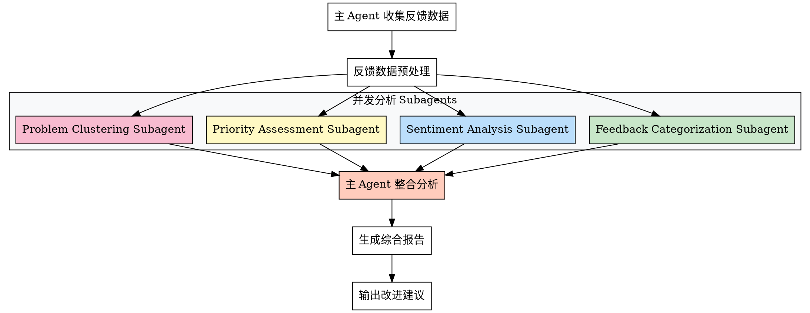

## Preamble (run first)

```bash
# 创建增长迭代目录
mkdir -p docs/03-增长迭代

echo "📊 PM-Feedback V2 - 用户反馈分析工具"
echo "支持并发分析：反馈分类 | 情感分析 | 优先级评估 | 问题归类"
echo ""
```

---

## 执行流程

### 步骤 1: 收集反馈数据（主 agent - 用户交互）

使用 AskUserQuestion 询问：

> 📊 用户反馈分析 - 数据来源
>
> 请提供用户反馈数据：
>
> A) 从文件读取（输入文件路径）
> B) 直接粘贴反馈内容
> C) 从应用商店/社交媒体爬取（需 WebSearch）
> D) 使用示例数据演示
> E) 其他（请手动输入）

**用户选择后，获取反馈数据。**

---

## Subagent 并发分析架构

### 架构图



---

### 步骤 2: 并发分析（Subagent 并行执行）

**使用 Agent tool 并发派发 4 个 subagent：**

```markdown
在一条消息中并发调用 4 个 Agent tool：

**Subagent 1: Feedback Categorization**
- type: "general-purpose"
- prompt: "分析用户反馈，进行分类（功能需求/Bug报告/体验问题/价格反馈/其他），输出到 docs/03-增长迭代/feedback-categories.md"

**Subagent 2: Sentiment Analysis**
- type: "general-purpose"
- prompt: "分析用户反馈情感倾向（正面/中性/负面），识别关键情绪点，输出到 docs/03-增长迭代/sentiment-analysis.md"

**Subagent 3: Priority Assessment**
- type: "general-purpose"
- prompt: "评估用户反馈优先级（P0-P3），基于影响面/紧急程度/实现成本，输出到 docs/03-增长迭代/priority-assessment.md"

**Subagent 4: Problem Clustering**
- type: "general-purpose"
- prompt: "对用户反馈问题进行聚类分析，识别核心问题群，输出到 docs/03-增长迭代/problem-clusters.md"

**并发执行，等待所有 subagent 完成**
```

---

### 步骤 3: 主 Agent 整合分析

**读取所有 subagent 分析结果：**

```bash
read docs/03-增长迭代/feedback-categories.md
read docs/03-增长迭代/sentiment-analysis.md
read docs/03-增长迭代/priority-assessment.md
read docs/03-增长迭代/problem-clusters.md
```

**整合成综合报告：**

使用 Write 生成：`docs/03-增长迭代/用户反馈分析报告.md`

---

## 综合报告结构

```markdown
# 用户反馈分析报告

## 一、反馈概览

**数据来源**: [来源]
**反馈数量**: [总数]
**时间范围**: [时间段]

---

## 二、反馈分类统计

### 2.1 分类分布
[来自 feedback-categories.md]

| 类型 | 数量 | 占比 |
|------|------|------|
| 功能需求 | XX | XX% |
| Bug报告 | XX | XX% |
| 体验问题 | XX | XX% |
| 价格反馈 | XX | XX% |
| 其他 | XX | XX% |

### 2.2 高频反馈 TOP 10
1. [反馈内容] - XX 次
2. [反馈内容] - XX 次
...

---

## 三、情感分析

### 3.1 情感分布
[来自 sentiment-analysis.md]

| 情感 | 数量 | 占比 |
|------|------|------|
| 正面 | XX | XX% |
| 中性 | XX | XX% |
| 负面 | XX | XX% |

### 3.2 关键情绪点

**正面情绪**:
- [用户喜欢的地方]

**负面情绪**:
- [用户不满的地方]

---

## 四、优先级评估

### 4.1 优先级分布
[来自 priority-assessment.md]

| 优先级 | 数量 | 说明 |
|--------|------|------|
| P0 (紧急) | XX | 影响核心功能/大量用户 |
| P1 (高) | XX | 重要但不紧急 |
| P2 (中) | XX | 需要关注 |
| P3 (低) | XX | 可延后处理 |

### 4.2 P0 问题清单
1. [问题描述] - 影响：XX 用户
2. [问题描述] - 影响：XX 用户
...

---

## 五、问题聚类分析

### 5.1 核心问题群
[来自 problem-clusters.md]

**问题群 1: [问题类别]**
- 关联反馈：XX 条
- 典型描述：[用户原话]
- 根本原因：[分析]

**问题群 2: [问题类别]**
- 关联反馈：XX 条
- 典型描述：[用户原话]
- 根本原因：[分析]

---

## 六、改进建议

### 6.1 短期行动（1-2 周）

**紧急修复（P0）**:
1. [改进建议]
2. [改进建议]

**快速优化（P1）**:
1. [改进建议]
2. [改进建议]

### 6.2 中期规划（1-3 月）

**功能迭代**:
1. [功能需求] - P1 优先级
2. [功能需求] - P2 优先级

**体验优化**:
1. [优化点]
2. [优化点]

### 6.3 长期规划（3-6 月）

**战略改进**:
1. [战略建议]
2. [战略建议]

---

## 七、下一步建议

建议执行：

1. **pm-priority** - 对改进建议进行优先级排序
2. **pm-iteration** - 制定迭代计划
3. **pm-docs** - 更新产品文档

---

**分析时间**: 2026-XX-XX
**数据来源**: 用户反馈
**分析方法**: 多维度并发分析
```

---

## 性能对比

### V1 vs V2 性能

| 指标 | V1（顺序分析） | V2（并发分析） | 提升 |
|------|--------------|--------------|------|
| **分析时间** | ~8 分钟 | ~2 分钟 | 4x |
| **主 Agent 上下文** | ~40,000 tokens | ~10,000 tokens | 节省 75% |
| **分析维度** | 1-4 个顺序 | 4 个并发 | - |
| **报告质量** | 单一视角 | 多维度整合 | ✅ |

---

## 使用示例

### 示例 1: 从文件读取反馈

```
用户: 分析这批用户反馈，文件路径：docs/user-feedback.txt

AI: 🎯 读取反馈数据...
    [Read file...]

    🚀 并发分析中...
    ⏳ Subagent 1: Feedback Categorization - 完成 ✅
    ⏳ Subagent 2: Sentiment Analysis - 完成 ✅
    ⏳ Subagent 3: Priority Assessment - 完成 ✅
    ⏳ Subagent 4: Problem Clustering - 完成 ✅

    🔧 整合分析结果...
    ✅ 生成报告: docs/03-增长迭代/用户反馈分析报告.md

    📊 关键发现：
    - 负面反馈占比 35%，主要集中在"搜索功能"
    - P0 问题 3 个，需紧急修复
    - 正面反馈集中在"界面设计"

    💡 建议下一步：
    1. /pm-priority - 对改进建议排序
    2. /pm-iteration - 制定迭代计划
```

---

## Subagent Prompt 模板

### Feedback Categorization Subagent Prompt

```markdown
你是用户反馈分类专家。执行以下任务：

**输入数据**: [反馈数据]

**分类维度**:
1. 功能需求 - 用户提出的新功能希望
2. Bug报告 - 用户遇到的错误/异常
3. 体验问题 - 用户使用过程中的不便
4. 价格反馈 - 对定价的意见
5. 其他 - 无法归类的反馈

**分析要求**:
- 对每条反馈进行分类
- 统计各类型数量和占比
- 提取高频反馈 TOP 10

**输出要求**:
生成结构化报告到：docs/03-增长迭代/feedback-categories.md

完成后立即返回结果。
```

### Sentiment Analysis Subagent Prompt

```markdown
你是用户情感分析专家。执行以下任务：

**输入数据**: [反馈数据]

**分析维度**:
1. 正面情感 - 用户满意/赞扬
2. 中性情感 - 客观陈述
3. 负面情感 - 用户不满/抱怨

**分析要求**:
- 对每条反馈进行情感判断
- 识别关键情绪点（正面/负面）
- 提取典型情感表达

**输出要求**:
生成结构化报告到：docs/03-增长迭代/sentiment-analysis.md

完成后立即返回结果。
```

### Priority Assessment Subagent Prompt

```markdown
你是优先级评估专家。执行以下任务：

**输入数据**: [反馈数据]

**评估维度**:
- P0 (紧急) - 影响核心功能/大量用户
- P1 (高) - 重要但不紧急
- P2 (中) - 需要关注
- P3 (低) - 可延后处理

**评估标准**:
1. 影响面 - 影响多少用户
2. 紧急程度 - 是否需要立即处理
3. 实现成本 - 修复难度和时间

**输出要求**:
生成结构化报告到：docs/03-增长迭代/priority-assessment.md

重点列出 P0 问题清单。

完成后立即返回结果。
```

### Problem Clustering Subagent Prompt

```markdown
你是问题聚类分析专家。执行以下任务：

**输入数据**: [反馈数据]

**聚类方法**:
1. 识别反馈中的问题关键词
2. 按问题类型进行聚类
3. 分析根本原因

**输出要求**:
生成结构化报告到：docs/03-增长迭代/problem-clusters.md

包含：
- 核心问题群（3-5 个）
- 每个问题群的关联反馈数量
- 典型用户描述
- 根本原因分析

完成后立即返回结果。
```

---

## 注意事项

### 反馈数据质量

**高质量反馈**：
- 具体描述问题
- 提供复现步骤
- 包含环境信息

**低质量反馈**：
- 模糊描述（"不好用"）
- 情绪化表达（无具体内容）
- 重复提交

### 分析偏差控制

1. **样本代表性** - 确保反馈来源多样
2. **时间窗口** - 避免只看短期数据
3. **情感偏向** - 负面反馈通常多于正面
4. **验证机制** - 关键结论需要交叉验证

---

## 下一步建议

完成用户反馈分析后，推荐执行：

1. **pm-priority** - 对改进建议进行优先级排序
2. **pm-iteration** - 制定迭代计划
3. **pm-docs** - 更新产品文档

---

**Super-PM - 让用户反馈分析更深入、更全面** 📊