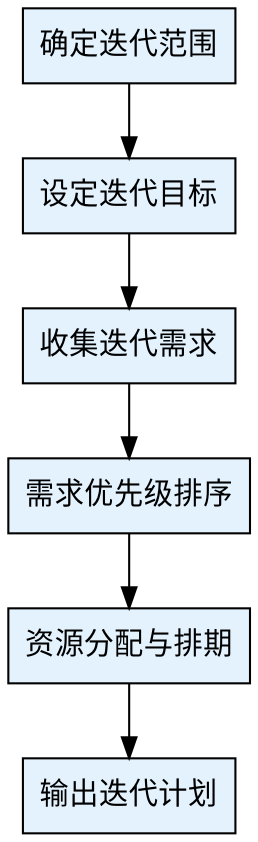
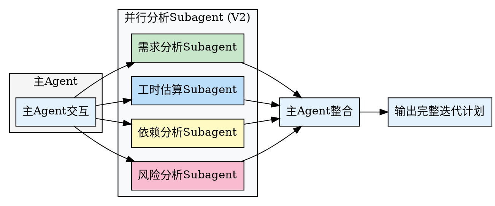

## Preamble

```bash
bash "$(dirname "${BASH_SOURCE[0]}")"/check-update.sh 2>/dev/null || true
mkdir -p docs/03-增长迭代

echo "🔄 迭代计划工具已启动"

# 检查前置数据
echo "📊 正在检查前置数据..."
if [ -f "docs/03-增长迭代/数据报告与用户反馈.md" ]; then
  echo "✅ 数据报告 - 已找到"
fi
if [ -f "docs/03-增长迭代/产品路线图.md" ]; then
  echo "✅ 产品路线图 - 已找到"
fi
```

---

## 执行流程



### 步骤 1: 确定迭代范围

使用 AskUserQuestion 询问：

> 📋 迭代规划
>
> **迭代编号**：第X次迭代
> **迭代周期**：建议2周
>
> 本次迭代的输入来源：
>
> A) 数据分析结果（数据驱动优化）
> B) 用户反馈（用户需求驱动）
> C) 竞品分析（市场变化驱动）
> D) 技术优化（性能/架构提升）
> E) 业务目标（战略调整）
> F) 以上多项组合
> G) 产品路线图拆解（从长期规划中提取）
>
> 💡 提示：建议每次迭代聚焦1-2个核心目标

记录到变量 `ITERATION_INPUT`

---

### 步骤 2: 设定迭代目标

> 🎯 设定迭代目标
>
> 本次迭代的核心目标是什么？（建议1-2个）
>
> **目标示例**：
> - 提升注册转化率至30%
> - 完成XX功能开发上线
> - 修复Top 5用户反馈问题
>
> **目标1**：{目标描述}
> **目标2**：{目标描述}
>
> 每个目标需要可衡量，如"将XX指标从X%提升到Y%"

---

### 步骤 3: 收集迭代需求

> 📝 本次迭代的需求清单：
>
> 请列出本次迭代需要完成的需求/任务（每个一行）：
>
> 示例：
> - 优化注册流程（来源：数据驱动 - 注册转化率低）
> - 新增商品搜索功能（来源：用户反馈）
> - 修复首页加载慢问题（来源：技术优化）
>
> 输入"完成"结束录入

收集到列表 `REQUIREMENT_LIST`

---

### 步骤 4: 需求优先级排序

基于价值和成本对需求排序：

> 🎯 需求优先级排序
>
> **P0（必须有）**：影响核心目标或阻塞其他需求
> **P1（应该有）**：重要但不紧急
> **P2（可以有）**：锦上添花
>
> 对每个需求确认优先级：
>
> 需求"{需求名称}"的优先级？
>
> A) P0 - 必须有
> B) P1 - 应该有
> C) P2 - 可以有
> D) 推迟到下次迭代

---

### 步骤 5: 资源分配与排期

> 👥 资源分配：
>
> 可用开发资源：
> - 前端：[X]人
> - 后端：[X]人
> - 设计：[X]人
> - QA：[X]人
>
> **工时估算**：
>
> | 需求 | 优先级 | 前端工时 | 后端工时 | 总工时 |
> |------|--------|---------|---------|--------|
> | {需求1} | P0 | X天 | X天 | X天 |
> | {需求2} | P0 | X天 | X天 | X天 |
> | {需求3} | P1 | X天 | X天 | X天 |
> | **合计** | | **X天** | **X天** | **X天** |
>
> **风险评估**：
> - 总工时是否在迭代容量内？
> - 是否存在阻塞依赖？
> - 是否需要调整范围？

---

### 步骤 6: 输出迭代计划

使用 Write 工具创建 `docs/03-增长迭代/迭代计划-v{版本号}.md`：

```markdown
# 迭代计划 v{版本号}

## 一、迭代概览

- **迭代编号**：第X次迭代
- **周期**：YYYY-MM-DD 至 YYYY-MM-DD（2周）
- **核心目标**：
  1. {目标1}
  2. {目标2}

## 二、需求清单

| 优先级 | 需求名称 | 来源 | 前端工时 | 后端工时 | 负责人 |
|--------|---------|------|---------|---------|--------|
| P0 | {需求1} | {来源} | X天 | X天 | {负责人} |
| P0 | {需求2} | {来源} | X天 | X天 | {负责人} |
| P1 | {需求3} | {来源} | X天 | X天 | {负责人} |
| P2 | {需求4} | {来源} | X天 | X天 | {负责人} |

## 三、排期计划

### 第1周
- Day 1-2：{任务}
- Day 3-4：{任务}
- Day 5：{任务}

### 第2周
- Day 6-7：{任务}
- Day 8-9：{任务}
- Day 10：交付/测试/上线

## 四、风险与预案

| 风险 | 概率 | 影响 | 预案 |
|------|------|------|------|
| {风险} | H/M/L | H/M/L | {预案} |

## 五、验收标准

- 所有P0需求完成开发并测试通过
- {目标1}达成：{衡量标准}
- {目标2}达成：{衡量标准}

---

**文档状态**: 迭代计划完成
**生成时间**: {时间戳}
**生成工具**: super-pm v1.0.0
```

---

### 步骤 7: 完成提示

> ✅ 迭代计划完成！
>
> 📄 已生成：`docs/03-增长迭代/迭代计划-v{版本号}.md`
>
> 🎯 建议下一步：
>
> A) 执行 /pm-risk - 风险管控方案
> B) 执行 /pm-agile - 敏捷管理方案
> C) 迭代开始后执行 /pm-report 跟踪进度

---

## 兜底机制

### 场景: 需求过多

如果需求总工时超过迭代容量：

> ⚠️ 需求总工时{X天}超过迭代容量{标准容量}
>
> 建议：
> A) 将部分P1/P2需求推迟到下个迭代
> B) 增加开发资源
> C) 延长迭代周期

---

## V2 并行架构升级

### 架构概览



### 并行Subagent分析

在确认需求清单后，并发派发4个Subagent：

**Subagent 1: 需求分析**
- 负责：评估需求的业务价值、用户影响面、关联度

**Subagent 2: 工时估算**
- 负责：基于历史数据估算各需求开发工时、测试工时

**Subagent 3: 依赖分析**
- 负责：识别需求间的技术依赖、团队依赖、外部依赖

**Subagent 4: 风险分析**
- 负责：识别排期风险、资源瓶颈、技术风险

### V1 vs V2 对比

| 指标 | V1（顺序分析） | V2（并行分析） | 提升 |
|------|--------------|--------------|------|
| **分析时间** | ~5分钟 | ~2分钟 | 2.5x |
| **主Agent上下文** | ~12,000 tokens | ~3,500 tokens | 节省71% |
| **分析维度** | 手动逐项估算 | 4维度并行评估 | - |
| **排期准确性** | 依赖经验 | 多维度交叉验证 | 更准确 |

---

## 注意事项

1. 每个迭代聚焦1-2个核心目标，避免目标过多
2. P0需求不超过迭代容量的60%
3. 预留20%缓冲时间应对突发问题
4. 迭代计划在迭代开始前确认并周知团队

---

## 输出质量对比

**✅ Good 示例**：
```
- 有数据引用：「根据 Q4 数据，留存率从 35% 降至 28%」
- 有验证来源：「数据来源：Google Analytics, 2025-12-01」
- 有明确建议：「建议将新手引导步骤从 5 步减少至 3 步」
```

**❌ Bad 示例**：
```
- 模糊结论：「数据表明留存率有所下降」
- 无来源：「根据经验，这个功能很重要」
- 没有行动建议：「留存是个问题」
```

---

## 常见误区 / Red Flags — STOP

出现以下情况立即停止并回溯：

| 误区 | 正确做法 |
|------|---------|
| 使用"应该"、"大概"、"看起来"做结论 | 必须基于实际数据和验证 |
| 未运行检查就声称已完成 | 先验证，再陈述 |
| 因时间紧迫跳过关键步骤 | 没有例外，时间紧更要严格 |
| "这次应该没问题"的想法 | 每次都要重新验证 |

---

## 产出质量检查 / Verification Checklist

- [ ] 前置依赖已满足（输入文档/数据已收集）
- [ ] 核心步骤已全部执行
- [ ] 输出文档已生成到 `docs/` 目录
- [ ] 每个判断都有数据/证据支撑
- [ ] 已推荐 2-3 个后续 skill

> ⚠️ 任何一项未通过 → 补全后再标记完成。

---
