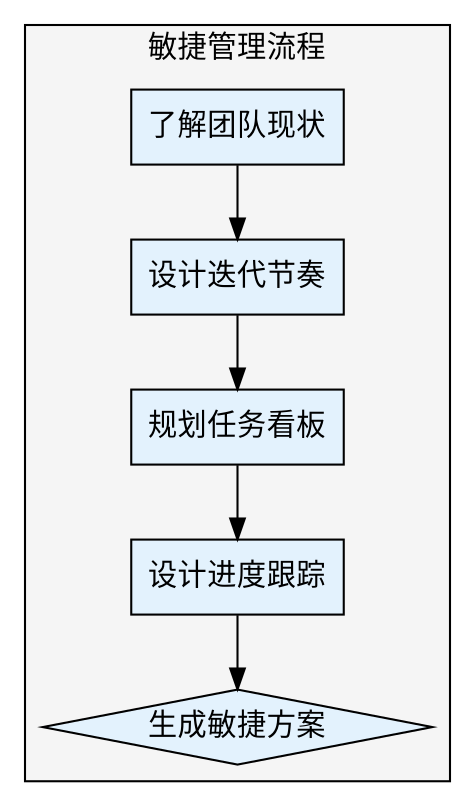

## Preamble

```bash
bash "$(dirname "${BASH_SOURCE[0]}")"/check-update.sh 2>/dev/null || true
mkdir -p docs/04-风控管理

echo "🚀 敏捷管理方案制定工具已启动"
```

---

## 执行流程



### 步骤 1: 了解团队现状

使用 AskUserQuestion:

> 📊 团队现状评估
>
> 请选择团队的规模：
>
> A) 小团队（2-5人）
> B) 中型团队（6-15人）
> C) 大型团队（16-30人）
> D) 多团队协作（30人以上）

继续询问：

> 🔄 敏捷成熟度评估
>
> 团队对敏捷开发的熟悉程度：
>
> A) 初次尝试（需要详细指导）
> B) 有一定基础（熟悉基本概念）
> C) 经验丰富（可自主优化）

### 步骤 2: 设计迭代节奏

使用 AskUserQuestion:

> ⏱️ 迭代周期规划
>
> 推荐的迭代周期：
>
> A) 1周（快速迭代，适合初创期）
> B) 2周（标准节奏，适合大多数团队）
> C) 3周（复杂项目，需要更多开发时间）
> D) 4周（大型项目，协调成本高）

继续询问：

> 📅 迭代会议规划
>
> 需要哪些迭代会议：
>
> A) 标准会议（计划会、每日站会、评审会、复盘会）
> B) 精简会议（仅计划会和评审会）
> C) 自定义会议流程

### 步骤 3: 规划任务看板

使用 AskUserQuestion:

> 📋 任务看板类型
>
> 选择适合的看板模式：
>
> A) 待办-进行中-已完成（基础看板）
> B) 待办-开发-测试-已完成（标准看板）
> C) 待办-分析-开发-测试-验收-已完成（详细看板）
> D) 自定义看板流程

### 步骤 4: 设计进度跟踪机制

使用 AskUserQuestion:

> 📈 进度跟踪频率
>
> 需要多频繁的进度跟踪：
>
> A) 每日（每日站会 + 看板更新）
> B) 每周（周报 + 周会）
> C) 按迭代（仅在迭代结束时统计）
> D) 实时（自动化工具 + 仪表盘）

### 步骤 5: 生成敏捷管理方案

使用 Write 工具生成 `docs/04-风控管理/敏捷管理方案.md`。

---

## Subagent 并行加速（v2.0.0 新增）

利用 Agent 工具并行执行独立子任务，大幅缩短总执行时间。

### 可并行子任务

当步骤1-4的用户信息收集完成后，以下两个任务可以并行执行：

| 子任务 | 说明 |
|--------|------|
| 迭代节奏推演 | 基于团队规模和敏捷成熟度，推演最优迭代周期和会议频次 |
| 看板与追踪设计 | 根据团队偏好，设计任务看板列配置和进度跟踪机制 |

### 触发方式

在步骤5生成文档前，使用 Agent 工具激活子任务并行执行。

### V1 vs V2 对比

| 维度 | V1.1.0（串行） | V2.0.0（Subagent并行） | 节省 |
|------|---------------|----------------------|------|
| 迭代节奏推演 | 用户逐一回答4轮问题 | Agent并行分析，一步完成 | 约3轮交互 |
| 看板与追踪设计 | 依次设计看板和追踪 | Agent并行输出两个方案 | 约2轮交互 |
| 总交互轮次 | 约8-10轮 | 约4-5轮 | 减少50%+ |
| 耗时估算 | 8-12分钟 | 4-6分钟 | 节省约5分钟 |

---

## 输出文件

敏捷管理方案 → `docs/04-风控管理/敏捷管理方案.md`

---

## 输出文档模板

```markdown
# 敏捷管理方案

## 一、团队概况

- **团队规模**: [从步骤1提取]
- **敏捷成熟度**: [从步骤1提取]
- **迭代周期**: [从步骤2提取]
- **生成时间**: [当前时间]

---

## 二、迭代节奏设计

### 2.1 迭代周期

**周期长度**: X周

**选择理由**: [说明为什么选择这个周期]

### 2.2 迭代会议安排

| 会议类型 | 频率 | 时长 | 参与者 | 目的 |
|---------|------|------|--------|------|
| 迭代计划会 | 迭代首日 | 2小时 | 全员 | 明确迭代目标与任务 |
| 每日站会 | 每日 | 15分钟 | 开发团队 | 同步进度与问题 |
| 迭代评审会 | 迭代末日 | 1小时 | 全员+stakeholder | 展示成果 |
| 迭代复盘会 | 迭代末日 | 1小时 | 全员 | 总结改进 |

---

## 三、任务看板设计

### 3.1 看板列设置

**看板类型**: [从步骤3提取]

**列定义**:
- **待办（To Do）**: 已确认但未开始的任务
- **开发中（In Progress）**: 正在开发的任务
- **测试中（Testing）**: 开发完成，等待测试
- **已完成（Done）**: 测试通过，可发布

### 3.2 任务卡片规范

每个任务卡片必须包含：
- 任务ID（如: TASK-001）
- 任务标题
- 负责人
- 预计工时
- 实际工时
- 优先级（P0/P1/P2/P3）
- 标签（如: 前端、后端、设计）

### 3.3 WIP限制

建议设置在制品限制（WIP Limit）:
- 每人同时在开发的任务数 ≤ 2
- 测试队列任务数 ≤ 开发人数

---

## 四、进度跟踪机制

### 4.1 跟踪方式

**跟踪频率**: [从步骤4提取]

**跟踪指标**:
- 迭代燃尽图（Burndown Chart）
- 任务完成率
- 阻塞问题数
- 团队速率（Velocity）

### 4.2 进度报告

**日报模板**:
```markdown
## 今日进展
- 完成任务：[任务列表]
- 进行中任务：[任务列表]
- 遇到问题：[问题描述]

## 明日计划
- 计划完成任务：[任务列表]
```

**迭代报告模板**:
```markdown
## 迭代概况
- 迭代目标达成情况
- 完成任务数 / 计划任务数
- 团队速率（故事点）

## 质量指标
- Bug数量
- 测试覆盖率
- 上线成功率

## 改进措施
- [下个迭代的改进点]
```

---

## 五、角色与职责

| 角色 | 职责 | 关键产出 |
|------|------|---------|
| 产品负责人（PO） | 需求优先级排序、验收确认 | 产品Backlog、验收标准 |
| Scrum Master | 流程推进、问题解决 | 迭代计划、风险报告 |
| 开发团队 | 任务开发、技术实现 | 代码、技术文档 |
| 测试团队 | 质量保障、Bug验证 | 测试用例、测试报告 |

---

## 六、风险管理

### 6.1 常见风险

- **需求变更频繁** → 建立变更评审机制
- **技术债务累积** → 每个迭代预留20%时间还债
- **团队协作问题** → 定期复盘，持续改进

### 6.2 风险应对预案

建立风险看板，实时追踪：
- 风险等级（红/黄/绿）
- 影响范围
- 应对措施
- 负责人

---

## 七、工具推荐

### 7.1 任务管理工具

- **Jira**: 功能强大，适合大型团队
- **Trello**: 轻量级看板，适合小团队
- **飞书/钉钉**: 国内团队，集成协作功能
- **Linear**: 现代化工具，体验优秀

### 7.2 协作工具

- **文档协作**: Notion、飞书文档、语雀
- **沟通协作**: Slack、飞书、钉钉
- **代码协作**: Git + GitLab/GitHub

---

## 八、实施建议

### 8.1 启动阶段

1. **第一周**: 确定迭代节奏，搭建看板
2. **第二周**: 第一次迭代，熟悉流程
3. **第三周**: 第一次复盘，调整优化
4. **第四周**: 稳定运行，固化流程

### 8.2 持续改进

- 每个迭代至少1个改进措施
- 季度回顾流程，重大调整
- 保持灵活性，避免教条主义

---

## 九、下一步建议

建议执行：
1. /pm-cross（制定跨部门协作方案）
2. /pm-risk（识别项目风险）
3. /pm-release（规划上线方案）

---

## 输出质量对比

**✅ Good 示例**：
```
- 有数据引用：「根据 Q4 数据，留存率从 35% 降至 28%」
- 有验证来源：「数据来源：Google Analytics, 2025-12-01」
- 有明确建议：「建议将新手引导步骤从 5 步减少至 3 步」
```

**❌ Bad 示例**：
```
- 模糊结论：「数据表明留存率有所下降」
- 无来源：「根据经验，这个功能很重要」
- 没有行动建议：「留存是个问题」
```

---

## 常见误区 / Red Flags — STOP

出现以下情况立即停止并回溯：

| 误区 | 正确做法 |
|------|---------|
| 使用"应该"、"大概"、"看起来"做结论 | 必须基于实际数据和验证 |
| 未运行检查就声称已完成 | 先验证，再陈述 |
| 因时间紧迫跳过关键步骤 | 没有例外，时间紧更要严格 |
| "这次应该没问题"的想法 | 每次都要重新验证 |

---

## 产出质量检查 / Verification Checklist

- [ ] 前置依赖已满足（输入文档/数据已收集）
- [ ] 核心步骤已全部执行
- [ ] 输出文档已生成到 `docs/` 目录
- [ ] 每个判断都有数据/证据支撑
- [ ] 已推荐 2-3 个后续 skill

> ⚠️ 任何一项未通过 → 补全后再标记完成。

---

**项目状态**: 敏捷管理方案已制定
**生成时间**: [时间戳]
**生成工具**: super-pm v1.0.0
```

---

## 推荐下一步

执行完成后，输出：

✅ 敏捷管理方案已生成！

🎯 建议下一步：
1. /pm-cross（制定跨部门协作方案）
2. /pm-risk（识别项目风险）
3. /pm-release（规划上线方案）
