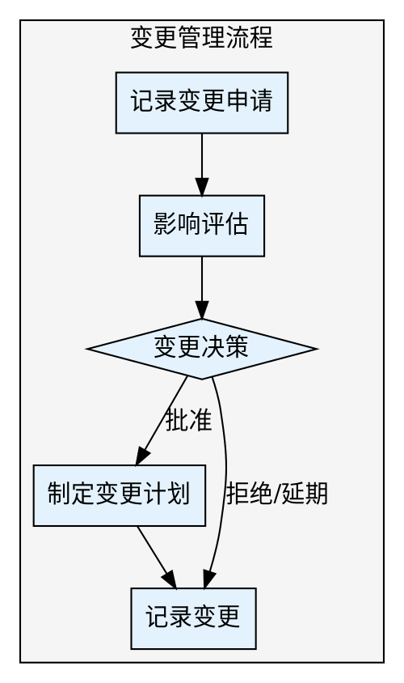

## Preamble

```bash
bash "$(dirname "${BASH_SOURCE[0]}")"/check-update.sh 2>/dev/null || true
mkdir -p docs/04-风控管理

echo "📝 需求变更管理工具已启动"
```

---

## 执行流程



### 步骤 1: 记录变更申请

使用 AskUserQuestion:

> 📋 变更来源
>
> 变更申请的来源：
>
> A) 用户反馈（用户需求变化）
> B) 竞品动态（市场变化）
> C) 业务调整（战略调整）
> D) 技术限制（技术实现问题）
> E) 法规要求（合规需求）
> F) 其他原因（请手动输入）

继续询问：

> 🎯 变更类型
>
> 本次变更的类型：
>
> A) 新增需求（增加新功能）
> B) 修改需求（调整现有功能）
> C) 删除需求（取消原定功能）
> D) 优先级调整（改变开发顺序）

### 步骤 2: 影响评估

使用 AskUserQuestion:

> 📊 影响范围评估
>
> 变更影响哪些方面？（可多选）
>
> A) 功能范围（新增/修改功能模块）
> B) 开发进度（工期延长）
> C) 技术架构（架构调整）
> D) 测试范围（回归测试）
> E) 用户体验（交互变化）
> F) 数据迁移（数据结构变化）
> G) 第三方集成（接口变化）
> H) 成本预算（资源增加）

继续询问：

> ⏱️ 影响程度评估
>
> 变更的影响程度：
>
> A) 轻微影响（工期 < 2天，影响 < 1个模块）
> B) 中等影响（工期 2-5天，影响 1-3个模块）
> C) 重大影响（工期 > 5天，影响 > 3个模块）
> D) 致命影响（影响核心功能或架构）

### 步骤 3: 变更决策

使用 AskUserQuestion:

> ✅ 变更审批级别
>
> 根据影响程度，需要谁审批？
>
> A) 项目经理审批（轻微影响）
> B) 产品负责人 + 技术负责人审批（中等影响）
> C) 变更控制委员会（CCB）审批（重大影响）
> D) 指导委员会审批（致命影响）

继续询问：

> 🔄 变更决策结果
>
> 变更审批结果：
>
> A) 批准变更（同意执行）
> B) 有条件批准（需满足特定条件）
> C) 延期评估（稍后再议）
> D) 拒绝变更（不执行）

### 步骤 4: 制定变更计划

使用 AskUserQuestion:

> 📅 变更执行时机
>
> 何时执行变更？
>
> A) 立即执行（紧急变更）
> B) 当前迭代（本周内）
> C) 下个迭代（下周）
> D) 后续版本（排入待办）

### 步骤 5: 记录变更

使用 Write 工具更新 `docs/04-风控管理/需求变更记录.md`。

---

## Subagent 并行加速（v2.0.0 新增）

利用 Agent 工具并行执行独立子任务，大幅缩短总执行时间。

### 可并行子任务

当步骤1-4的用户信息收集完成后，以下两个任务可以并行执行：

| 子任务 | 说明 |
|--------|------|
| 影响深度分析 | 基于变更类型和影响范围，自动生成影响评估矩阵 |
| 变更计划草拟 | 根据审批结果和执行时机，自动生成变更执行计划文档 |

### 触发方式

在步骤5生成文档前，使用 Agent 工具激活子任务并行执行。

### V1 vs V2 对比

| 维度 | V1.1.0（串行） | V2.0.0（Subagent并行） | 节省 |
|------|---------------|----------------------|------|
| 影响分析 | 用户逐一回答影响范围 | Agent并行分析多维度影响 | 约3轮交互 |
| 变更计划 | 依次询问执行细节 | Agent自动生成执行计划 | 约2轮交互 |
| 总交互轮次 | 约10-12轮 | 约5-7轮 | 减少45%+ |
| 耗时估算 | 10-15分钟 | 5-8分钟 | 节省约6分钟 |

---

## 输出文件

需求变更记录 → `docs/04-风控管理/需求变更记录.md`

---

## 输出文档模板

```markdown
# 需求变更记录

## 一、变更概况

- **变更申请总数**: [累计数量]
- **已批准**: [数量]
- **已拒绝**: [数量]
- **待评估**: [数量]
- **生成时间**: [当前时间]

---

## 二、变更记录表

| 变更ID | 申请日期 | 变更内容 | 来源 | 类型 | 影响程度 | 审批结果 | 执行状态 |
|--------|---------|---------|------|------|---------|---------|---------|
| CH-001 | 2026-03-25 | 新增导出功能 | 用户反馈 | 新增 | 中等 | 已批准 | 已完成 |
| CH-002 | 2026-03-26 | 修改登录流程 | 竞品动态 | 修改 | 重大 | 待评估 | 待执行 |
| CH-003 | 2026-03-27 | 删除分享功能 | 业务调整 | 删除 | 轻微 | 已批准 | 进行中 |

---

## 三、变更详情

### CH-001: 新增导出功能

#### 3.1 变更申请

**申请日期**: 2026-03-25
**申请人**: 产品负责人
**变更来源**: 用户反馈
**变更类型**: 新增需求

**变更描述**:
用户反馈需要导出数据报表功能，当前系统仅支持在线查看，无法导出Excel或PDF格式。

**变更原因**:
- 用户场景：管理层需要离线查看报表
- 业务价值：提升用户满意度，降低流失率
- 紧急程度：高（已有多位用户投诉）

#### 3.2 影响评估

**影响范围**:
- ✅ 功能范围：新增导出模块
- ✅ 开发进度：预计增加3天工期
- ✅ 测试范围：需测试多种格式导出
- ✅ 数据迁移：无需迁移

**影响程度**: 中等影响
- 工期延长：3天
- 影响模块：数据报表模块
- 资源需求：前端1人，后端1人

**风险评估**:
- 技术风险：低（成熟技术方案）
- 进度风险：中（需调整迭代计划）
- 质量风险：低（功能相对独立）

#### 3.3 变更决策

**审批级别**: 产品负责人 + 技术负责人审批

**审批结果**: ✅ 已批准

**批准条件**:
- 不影响当前迭代核心目标
- 导出功能支持Excel和PDF两种格式
- 文件大小限制在10MB以内

**批准人**: 产品负责人、技术负责人
**批准日期**: 2026-03-25

#### 3.4 执行计划

**执行时机**: 下个迭代（2026-03-28 开始）

**任务拆分**:
- 设计导出接口（后端，0.5天）
- 实现导出逻辑（后端，1天）
- 开发导出UI（前端，0.5天）
- 测试验证（测试，1天）

**责任人**:
- 后端开发：张三
- 前端开发：李四
- 测试：王五

**验收标准**:
- 支持导出Excel和PDF格式
- 文件大小限制在10MB以内
- 导出时间 < 30秒

#### 3.5 执行状态

**当前状态**: ✅ 已完成

**完成日期**: 2026-04-01

**实际情况**:
- 实际工期：3天（符合预期）
- 测试通过：无严重Bug
- 用户反馈：满意

**经验总结**:
- 提前考虑文件大小限制，避免服务器压力
- 导出功能需要权限控制，防止数据泄露

---

### CH-002: 修改登录流程

#### 3.1 变更申请

**申请日期**: 2026-03-26
**申请人**: 产品负责人
**变更来源**: 竞品动态
**变更类型**: 修改需求

**变更描述**:
竞品已支持手机号一键登录，用户体验更优。当前登录流程需输入密码，步骤繁琐，用户流失率高。

**变更原因**:
- 竞品分析：竞品新增一键登录功能
- 用户数据：登录页流失率高达30%
- 业务价值：降低流失率，提升注册转化率

#### 3.2 影响评估

**影响范围**:
- ✅ 功能范围：修改登录模块
- ✅ 开发进度：预计增加7天工期
- ✅ 技术架构：需对接短信服务商
- ✅ 用户体验：交互流程变化
- ✅ 成本预算：短信费用增加

**影响程度**: 重大影响
- 工期延长：7天
- 影响模块：登录注册模块、用户中心
- 资源需求：前端1人，后端2人，设计1人
- 预算增加：短信费用约5000元/月

**风险评估**:
- 技术风险：中（需对接第三方短信服务）
- 进度风险：高（影响当前迭代）
- 成本风险：中（运营成本增加）

#### 3.3 变更决策

**审批级别**: 变更控制委员会（CCB）审批

**审批结果**: ⏳ 待评估

**待评估事项**:
- 短信服务商选型与成本评估
- 对现有登录用户的影响
- 是否支持多种登录方式并存

**下次评估时间**: 2026-03-28

---

## 四、变更统计

### 4.1 按来源统计

| 来源 | 数量 | 占比 |
|------|------|------|
| 用户反馈 | 5 | 50% |
| 竞品动态 | 2 | 20% |
| 业务调整 | 2 | 20% |
| 技术限制 | 1 | 10% |

### 4.2 按类型统计

| 类型 | 数量 | 占比 |
|------|------|------|
| 新增需求 | 4 | 40% |
| 修改需求 | 5 | 50% |
| 删除需求 | 1 | 10% |

### 4.3 按影响程度统计

| 影响程度 | 数量 | 占比 |
|---------|------|------|
| 轻微影响 | 6 | 60% |
| 中等影响 | 3 | 30% |
| 重大影响 | 1 | 10% |

### 4.4 按审批结果统计

| 审批结果 | 数量 | 占比 |
|---------|------|------|
| 已批准 | 7 | 70% |
| 已拒绝 | 2 | 20% |
| 待评估 | 1 | 10% |

---

## 五、变更控制流程

### 5.1 标准流程

```
变更申请 → 影响评估 → 变更决策 → 执行计划 → 变更实施 → 验证确认
```

### 5.2 快速通道

**适用场景**: 轻微影响且紧急的变更

**流程简化**:
```
变更申请 → 项目经理审批 → 立即执行
```

**审批时间**: 2小时内

### 5.3 变更冻结期

**冻结时间**: 迭代最后2天

**冻结范围**:
- 不接受非紧急变更
- 变更需升级至指导委员会审批

**例外情况**:
- P0级Bug修复
- 安全漏洞修复
- 法律合规要求

---

## 六、变更委员会（CCB）

### 6.1 成员组成

| 角色 | 姓名 | 职责 |
|------|------|------|
| 主席 | 项目经理 | 主持会议，推动决策 |
| 产品代表 | 产品负责人 | 评估业务价值 |
| 技术代表 | 技术负责人 | 评估技术影响 |
| 测试代表 | 测试负责人 | 评估质量影响 |
| 运营代表 | 运营负责人 | 评估运营影响 |

### 6.2 会议机制

**会议频率**:
- 常规：每周一次（周三下午）
- 紧急：重大变更随时召开

**会议议程**:
1. 审查待评估变更
2. 讨论变更影响
3. 进行变更决策
4. 制定执行计划

**决策方式**:
- 轻微影响：过半数通过
- 中等影响：2/3通过
- 重大影响：全体一致通过

---

## 七、变更管理最佳实践

### 7.1 变更申请规范

**必填信息**:
- 变更描述（清晰、具体）
- 变更原因（为什么需要变更）
- 预期效果（变更后达成什么目标）
- 影响评估（初步评估）

**附件材料**:
- 用户反馈截图
- 竞品分析报告
- 原型设计稿（如有）

### 7.2 影响评估要点

**评估维度**:
- 功能影响：涉及哪些模块
- 进度影响：工期延长多久
- 资源影响：需要哪些资源
- 成本影响：预算增加多少
- 风险影响：带来哪些风险

**评估工具**:
- 影响矩阵表
- 风险评估表
- 成本收益分析表

### 7.3 变更决策原则

**批准原则**:
- 业务价值明确且高
- 影响可控，资源充足
- 风险可接受

**拒绝原则**:
- 业务价值不明确
- 影响不可控
- 风险过高

**延期原则**:
- 价值明确但不紧急
- 当前资源不足
- 需要更多评估

### 7.4 变更执行规范

**执行前**:
- 更新项目计划
- 通知相关stakeholder
- 准备必要的资源

**执行中**:
- 按计划执行
- 及时同步进度
- 遇到问题及时上报

**执行后**:
- 验证变更效果
- 更新相关文档
- 记录实际影响

---

## 八、变更管理工具

### 8.1 变更申请表

使用在线表单（飞书表单、钉钉表单）收集变更申请：
- 变更标题
- 变更描述
- 变更原因
- 预期效果
- 申请人

### 8.2 变更跟踪看板

使用项目管理工具（Jira、Trello）跟踪变更状态：
- 待评估
- 已批准
- 已拒绝
- 进行中
- 已完成

### 8.3 变更统计报表

定期生成变更统计报表：
- 变更数量趋势
- 变更来源分布
- 变更影响程度分布
- 变更审批通过率

---

## 九、常见问题处理

### 9.1 变更申请过多

**问题**: 变更申请频繁，项目无法按计划推进

**解决方案**:
- 建立变更申请成本机制（申请需要成本）
- 设置变更配额（每个迭代限制变更数量）
- 引导需求前置确认（减少后期变更）

### 9.2 变更影响评估不准

**问题**: 变更执行后发现影响超出预期

**解决方案**:
- 建立影响评估检查清单
- 邀请多方参与评估（技术、测试、运营）
- 评估结果与实际对比，持续优化

### 9.3 变更决策效率低

**问题**: 变更审批流程长，影响响应速度

**解决方案**:
- 设置快速通道（轻微变更快速审批）
- 授权机制（项目经理一定审批权限）
- 定期召开CCB会议（集中处理）

---

## 十、下一步建议

建议执行：
1. /pm-retro（进行迭代复盘，总结变更管理经验）
2. /pm-roadmap（更新产品路线图）
3. /pm-agile（优化敏捷管理流程）

---

## 输出质量对比

**✅ Good 示例**：
```
- 有数据引用：「根据 Q4 数据，留存率从 35% 降至 28%」
- 有验证来源：「数据来源：Google Analytics, 2025-12-01」
- 有明确建议：「建议将新手引导步骤从 5 步减少至 3 步」
```

**❌ Bad 示例**：
```
- 模糊结论：「数据表明留存率有所下降」
- 无来源：「根据经验，这个功能很重要」
- 没有行动建议：「留存是个问题」
```

---

## 常见误区 / Red Flags — STOP

出现以下情况立即停止并回溯：

| 误区 | 正确做法 |
|------|---------|
| 使用"应该"、"大概"、"看起来"做结论 | 必须基于实际数据和验证 |
| 未运行检查就声称已完成 | 先验证，再陈述 |
| 因时间紧迫跳过关键步骤 | 没有例外，时间紧更要严格 |
| "这次应该没问题"的想法 | 每次都要重新验证 |

---

## 产出质量检查 / Verification Checklist

- [ ] 前置依赖已满足（输入文档/数据已收集）
- [ ] 核心步骤已全部执行
- [ ] 输出文档已生成到 `docs/` 目录
- [ ] 每个判断都有数据/证据支撑
- [ ] 已推荐 2-3 个后续 skill

> ⚠️ 任何一项未通过 → 补全后再标记完成。

---

**项目状态**: 需求变更记录已更新
**生成时间**: [时间戳]
**生成工具**: super-pm v2.0.0
```

---

## 推荐下一步

执行完成后，输出：

✅ 需求变更记录已更新！

🎯 建议下一步：
1. /pm-retro（进行迭代复盘，总结变更管理经验）
2. /pm-roadmap（更新产品路线图）
3. /pm-agile（优化敏捷管理流程）
