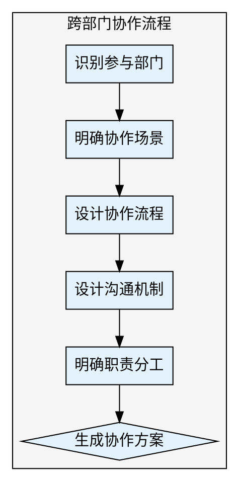

## Preamble

```bash
bash "$(dirname "${BASH_SOURCE[0]}")"/check-update.sh 2>/dev/null || true
mkdir -p docs/04-风控管理

echo "🤝 跨部门协作方案制定工具已启动"
```

---

## 执行流程



### 步骤 1: 识别参与部门

使用 AskUserQuestion:

> 🏢 参与部门识别
>
> 本次项目涉及哪些部门？（可多选）
>
> A) 产品部门（需求定义、验收）
> B) 研发部门（技术实现）
> C) 设计部门（UI/UX设计）
> D) 测试部门（质量保障）
> E) 运营部门（推广、用户反馈）
> F) 市场部门（品牌、宣传）
> G) 客服部门（用户支持）
> H) 法务部门（合规审查）
> I) 财务部门（预算审批）
> J) 其他部门（请手动输入）

### 步骤 2: 明确协作场景

使用 AskUserQuestion:

> 🔗 协作场景识别
>
> 主要的跨部门协作场景：
>
> A) 需求确认与评审
> B) 设计稿评审
> C) 技术方案评审
> D) 测试用例评审
> E) 上线发布评审
> F) 问题排查与解决
> G) 多项组合

### 步骤 3: 设计协作流程

使用 AskUserQuestion:

> 📋 协作流程模式
>
> 选择协作流程的严格程度：
>
> A) 正式流程（多级审批、文档完备）
> B) 标准流程（关键节点评审）
> C) 灵活流程（快速沟通、轻量文档）

继续询问：

> 🔄 协作依赖关系
>
> 部门间是否存在强依赖关系？
>
> A) 串行依赖（部门A完成 → 部门B开始）
> B) 并行协作（多部门同时进行）
> C) 混合模式（部分串行、部分并行）

### 步骤 4: 设计沟通机制

使用 AskUserQuestion:

> 💬 沟通会议频率
>
> 跨部门沟通会议的频率：
>
> A) 每日（快速同步）
> B) 每周（周会）
> C) 每迭代（迭代评审）
> D) 按需（有重要事项时召开）

继续询问：

> 📢 信息同步方式
>
> 项目信息同步的主要方式：
>
> A) 文档协作（Notion/飞书文档）
> B) 群组沟通（微信群/飞书群）
> C) 邮件通报
> D) 项目管理工具（Jira/Trello）
> E) 多种方式组合

### 步骤 5: 明确职责分工

使用 AskUserQuestion:

> 🎯 决策权归属
>
> 关键决策由谁负责：
>
> A) 产品负责人（PO）决策
> B) 项目经理（PM）协调决策
> C) 委员会决策（多部门负责人）
> D) 分层决策（按决策类型划分）

### 步骤 6: 生成跨部门协作方案

使用 Write 工具生成 `docs/04-风控管理/跨部门协作方案.md`。

---

## Subagent 并行加速（v2.0.0 新增）

利用 Agent 工具并行执行独立子任务，大幅缩短总执行时间。

### 可并行子任务

当步骤1-2的用户信息收集完成后，以下两个任务可以并行执行：

| 子任务 | 说明 |
|--------|------|
| RACI矩阵生成 | 基于参与部门和协作场景，自动生成职责分配矩阵 |
| 沟通机制设计 | 根据部门关系和协作模式，输出沟通会议和信息同步方案 |

### 触发方式

在步骤6生成文档前，使用 Agent 工具激活子任务并行执行。

### V1 vs V2 对比

| 维度 | V1.1.0（串行） | V2.0.0（Subagent并行） | 节省 |
|------|---------------|----------------------|------|
| 职责分配 | 用户逐一回答决策权问题 | Agent并行生成RACI矩阵 | 约3轮交互 |
| 沟通设计 | 依次询问会议和信息方式 | Agent并行输出沟通方案 | 约2轮交互 |
| 总交互轮次 | 约8-10轮 | 约4-6轮 | 减少45%+ |
| 耗时估算 | 8-12分钟 | 5-7分钟 | 节省约5分钟 |

---

## 输出文件

跨部门协作方案 → `docs/04-风控管理/跨部门协作方案.md`

---

## 输出文档模板

```markdown
# 跨部门协作方案

## 一、协作概况

- **参与部门**: [从步骤1提取]
- **协作场景**: [从步骤2提取]
- **协作模式**: [从步骤3提取]
- **生成时间**: [当前时间]

---

## 二、部门职责矩阵（RACI）

| 活动 | 产品 | 研发 | 设计 | 测试 | 运营 | 市场 |
|------|------|------|------|------|------|------|
| 需求定义 | R/A | C | C | C | C | I |
| 技术方案 | C | R/A | I | C | I | I |
| UI设计 | A | C | R | C | C | I |
| 开发实现 | I | R | C | C | I | I |
| 测试验收 | A | C | I | R | C | I |
| 上线发布 | A | R | I | C | R | C |

**图例**:
- **R (Responsible)**: 执行者
- **A (Accountable)**: 负责人（决策者）
- **C (Consulted)**: 被咨询者
- **I (Informed)**: 被告知者

---

## 三、协作流程设计

### 3.1 需求确认流程

```
产品部门 → 输出PRD
  ↓
技术评审会 → 研发、测试、设计参与
  ↓
需求确认 → 各部门签字
  ↓
进入开发
```

**关键节点**:
- 需求评审通过
- 技术方案确认
- 测试用例确认
- 设计稿确认

### 3.2 设计评审流程

```
设计部门 → 输出设计稿
  ↓
设计评审会 → 产品、研发、测试参与
  ↓
修改完善
  ↓
设计稿定稿 → 产品签字确认
```

### 3.3 上线发布流程

```
测试完成 → 测试报告
  ↓
上线评审会 → 全部门参与
  ↓
发布计划确认
  ↓
执行上线 → 各部门配合
```

---

## 四、沟通机制

### 4.1 会议安排

| 会议类型 | 频率 | 参与者 | 时长 | 目的 |
|---------|------|--------|------|------|
| 项目启动会 | 项目开始时 | 全员 | 1小时 | 对齐目标、明确职责 |
| 周例会 | 每周五 | 各部门负责人 | 1小时 | 同步进度、协调问题 |
| 需求评审会 | 按需 | 产品+研发+测试+设计 | 2小时 | 确认需求细节 |
| 上线评审会 | 上线前 | 全员 | 1小时 | 上线前检查 |

### 4.2 信息同步渠道

**主要渠道**: [从步骤4提取]

**文档协作**:
- 产品需求文档: `docs/02-方案设计/PRD产品需求文档.md`
- 技术方案: `docs/02-方案设计/技术对接方案.md`
- 测试用例: `docs/02-方案设计/用户故事清单.md`
- 项目进度: `docs/03-增长迭代/迭代计划.md`

**沟通群组**:
- 项目总群: 全员（重要通知）
- 研发群: 技术讨论
- 需求群: 需求澄清

**定期报告**:
- 周报: 每周五发送
- 月报: 每月最后一周
- 里程碑报告: 关键节点

---

## 五、资源协调机制

### 5.1 资源申请流程

```
需求部门 → 提交资源申请单
  ↓
项目经理评估 → 影响范围、时间成本
  ↓
协调会议 → 双方部门负责人参与
  ↓
资源调配 → 明确时间、产出
```

### 5.2 冲突解决机制

**资源冲突场景**:
- 多项目竞争同一资源
- 时间冲突（不同项目档期重叠）
- 优先级冲突

**解决流程**:
1. 项目经理协调
2. 升级至部门负责人
3. 提交指导委员会决策

---

## 六、决策机制

### 6.1 决策类型

| 决策类型 | 决策者 | 评审者 | 咨询者 |
|---------|--------|--------|--------|
| 需求变更 | 产品负责人 | 研发负责人 | 测试、设计 |
| 技术选型 | 研发负责人 | 架构师 | 产品、测试 |
| 上线时间 | 项目经理 | 全部门 | - |
| 资源调配 | 部门负责人 | 项目经理 | 相关部门 |

### 6.2 决策记录

所有重大决策需记录在 `docs/04-风控管理/需求变更记录.md`:
- 决策内容
- 决策原因
- 决策者
- 决策时间
- 影响范围

---

## 七、协作工具推荐

### 7.1 文档协作

- **飞书文档**: 国内团队，实时协作
- **Notion**: 功能强大，模板丰富
- **语雀**: 阿里出品，知识库管理

### 7.2 项目管理

- **Jira**: 功能完善，适合大型项目
- **飞书项目**: 轻量级，集成度高
- **Trello**: 看板式，简单易用

### 7.3 沟通工具

- **飞书**: 一站式协作
- **企业微信**: 微信生态
- **钉钉**: 阿里生态

---

## 八、常见问题处理

### 8.1 需求变更频繁

**问题**: 产品频繁变更需求，研发疲于应付

**解决方案**:
- 建立需求冻结期（每个迭代前2天）
- 变更评审机制（评估影响与成本）
- 变更申请单（书面记录）

### 8.2 信息不同步

**问题**: 部门间信息不对称，重复沟通

**解决方案**:
- 单一信息源（统一文档平台）
- 定期同步会议（周会）
- 自动化通知（工具集成）

### 8.3 责任推诿

**问题**: 出现问题时互相推卸责任

**解决方案**:
- RACI矩阵明确职责
- 决策记录可追溯
- 复盘机制（而非追责）

---

## 九、协作质量评估

### 9.1 协作满意度

每迭代收集反馈：
- 沟通效率（1-5分）
- 信息同步及时性（1-5分）
- 决策效率（1-5分）
- 整体满意度（1-5分）

### 9.2 协作效率指标

- 会议时长占比
- 需求澄清次数
- 决策响应时间
- 跨部门问题数

---

## 十、下一步建议

建议执行：
1. /pm-risk（识别项目风险）
2. /pm-release（规划上线方案）
3. /pm-change（建立变更管理机制）

---

## 输出质量对比

**✅ Good 示例**：
```
- 有数据引用：「根据 Q4 数据，留存率从 35% 降至 28%」
- 有验证来源：「数据来源：Google Analytics, 2025-12-01」
- 有明确建议：「建议将新手引导步骤从 5 步减少至 3 步」
```

**❌ Bad 示例**：
```
- 模糊结论：「数据表明留存率有所下降」
- 无来源：「根据经验，这个功能很重要」
- 没有行动建议：「留存是个问题」
```

---

## 常见误区 / Red Flags — STOP

出现以下情况立即停止并回溯：

| 误区 | 正确做法 |
|------|---------|
| 使用"应该"、"大概"、"看起来"做结论 | 必须基于实际数据和验证 |
| 未运行检查就声称已完成 | 先验证，再陈述 |
| 因时间紧迫跳过关键步骤 | 没有例外，时间紧更要严格 |
| "这次应该没问题"的想法 | 每次都要重新验证 |

---

## 产出质量检查 / Verification Checklist

- [ ] 前置依赖已满足（输入文档/数据已收集）
- [ ] 核心步骤已全部执行
- [ ] 输出文档已生成到 `docs/` 目录
- [ ] 每个判断都有数据/证据支撑
- [ ] 已推荐 2-3 个后续 skill

> ⚠️ 任何一项未通过 → 补全后再标记完成。

---

**项目状态**: 跨部门协作方案已制定
**生成时间**: [时间戳]
**生成工具**: super-pm v2.0.0
```

---

## 推荐下一步

执行完成后，输出：

✅ 跨部门协作方案已生成！

🎯 建议下一步：
1. /pm-risk（识别项目风险）
2. /pm-release（规划上线方案）
3. /pm-change（建立变更管理机制）
