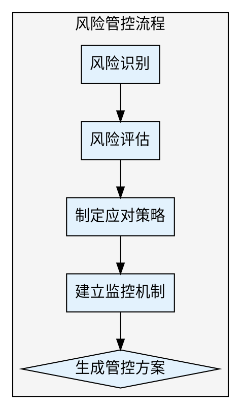

## Preamble

```bash
bash "$(dirname "${BASH_SOURCE[0]}")"/check-update.sh 2>/dev/null || true
mkdir -p docs/04-风控管理

echo "⚠️ 风险管控工具已启动"
```

---

## 执行流程



### 步骤 1: 风险识别

使用 AskUserQuestion:

> 🔍 风险类型识别
>
> 请识别项目中可能存在的风险类型（可多选）：
>
> A) 技术风险（技术难度、新技术引入、架构设计）
> B) 进度风险（工期紧张、资源不足、依赖延期）
> C) 需求风险（需求变更、需求模糊、需求蔓延）
> D) 资源风险（人员变动、预算不足、设备资源）
> E) 外部风险（第三方服务、政策法规、市场变化）
> F) 质量风险（测试不充分、技术债务、性能问题）
> G) 运营风险（用户接受度、推广难度、客服压力）
> H) 全部识别（系统化排查）

### 步骤 2: 风险评估

使用 AskUserQuestion:

> 📊 风险评估维度
>
> 如何评估风险严重程度？
>
> A) 概率 × 影响（标准方法）
> B) 矩阵评估（概率-影响矩阵）
> C) 定性评估（高/中/低）

### 步骤 3: 制定应对策略

使用 AskUserQuestion:

> 🛡️ 风险应对策略
>
> 针对已识别风险，优先采用哪种策略？
>
> A) 规避（改变计划，消除风险）
> B) 缓解（降低概率或影响）
> C) 转移（外包、保险）
> D) 接受（预留应急资源）
> E) 根据风险类型灵活选择

### 步骤 4: 建立监控机制

使用 AskUserQuestion:

> 📈 风险监控频率
>
> 需要多频繁地监控风险？
>
> A) 每日（高风险项目）
> B) 每周（标准监控）
> C) 每迭代（迭代评审时）
> D) 按需（发现预警信号时）

### 步骤 5: 生成风险管控方案

使用 Write 工具生成 `docs/04-风控管理/风险管控方案.md`。

---

## Subagent 并行加速（v2.0.0 新增）

利用 Agent 工具并行执行独立子任务，大幅缩短总执行时间。

### 可并行子任务

当步骤1-2的用户信息收集完成后，以下两个任务可以并行执行：

| 子任务 | 说明 |
|--------|------|
| 风险登记表生成 | 基于已识别风险类型，自动生成完整风险识别清单 |
| 应对策略编排 | 根据风险类型和评估方法，输出应对措施和应急预案 |

### 触发方式

在步骤5生成文档前，使用 Agent 工具激活子任务并行执行。

### V1 vs V2 对比

| 维度 | V1.1.0（串行） | V2.0.0（Subagent并行） | 节省 |
|------|---------------|----------------------|------|
| 风险登记 | 用户逐一确认风险项 | Agent并行生成风险清单 | 约3轮交互 |
| 应对策略 | 依次询问每个风险的应对 | Agent自动输出应对措施 | 约3轮交互 |
| 监控机制 | 逐个问询监控频率 | Agent并行输出监控方案 | 约2轮交互 |
| 总交互轮次 | 约10-12轮 | 约5-6轮 | 减少50%+ |
| 耗时估算 | 10-14分钟 | 5-7分钟 | 节省约6分钟 |

---

## 输出文件

风险管控方案 → `docs/04-风控管理/风险管控方案.md`

---

## 输出文档模板

```markdown
# 风险管控方案

## 一、风险管理概况

- **风险类型**: [从步骤1提取]
- **评估方法**: [从步骤2提取]
- **应对策略**: [从步骤3提取]
- **监控频率**: [从步骤4提取]
- **生成时间**: [当前时间]

---

## 二、风险识别清单

### 2.1 技术风险

| 风险ID | 风险描述 | 触发条件 | 早期预警信号 |
|--------|---------|---------|-------------|
| TR-001 | 技术选型不当，性能不达标 | 高并发场景 | 压测数据异常 |
| TR-002 | 第三方API不稳定 | 调用失败率上升 | 错误日志增加 |
| TR-003 | 新技术学习成本高 | 开发进度延迟 | 团队反馈困难 |

### 2.2 进度风险

| 风险ID | 风险描述 | 触发条件 | 早期预警信号 |
|--------|---------|---------|-------------|
| SC-001 | 核心人员离职 | 关键人员请假 | 团队士气低落 |
| SC-002 | 需求变更导致延期 | 变更频率增加 | 工时预估不足 |
| SC-003 | 依赖方延期交付 | 联调时间紧张 | 对方进度滞后 |

### 2.3 需求风险

| 风险ID | 风险描述 | 触发条件 | 早期预警信号 |
|--------|---------|---------|-------------|
| RQ-001 | 需求理解偏差 | 评审分歧 | 频繁澄清 |
| RQ-002 | 需求蔓延 | 功能不断增加 | 超出MVP范围 |
| RQ-003 | 伪需求 | 用户反馈冷淡 | 数据表现差 |

### 2.4 外部风险

| 风险ID | 风险描述 | 触发条件 | 早期预警信号 |
|--------|---------|---------|-------------|
| EX-001 | 政策法规变化 | 行业监管加强 | 行业新闻 |
| EX-002 | 竞品提前发布 | 市场动向 | 竞品动态 |
| EX-003 | 第三方服务中断 | 服务不可用 | 服务状态异常 |

---

## 三、风险评估矩阵

### 3.1 评估标准

**概率等级**:
- 高（3分）: 发生概率 > 50%
- 中（2分）: 发生概率 20%-50%
- 低（1分）: 发生概率 < 20%

**影响等级**:
- 高（3分）: 导致项目失败或重大损失
- 中（2分）: 影响进度或质量，但可控
- 低（1分）: 轻微影响，可快速恢复

**风险分数 = 概率 × 影响**

### 3.2 风险矩阵

| 风险ID | 风险描述 | 概率 | 影响 | 风险分数 | 优先级 |
|--------|---------|------|------|---------|--------|
| TR-001 | 技术选型不当 | 中(2) | 高(3) | 6 | 高 |
| SC-001 | 核心人员离职 | 低(1) | 高(3) | 3 | 中 |
| RQ-002 | 需求蔓延 | 高(3) | 中(2) | 6 | 高 |

### 3.3 优先级划分

**高优先级（风险分数 ≥ 6）**:
- 立即制定应对方案
- 每周监控状态
- 分配专人负责

**中优先级（风险分数 3-5）**:
- 制定应对预案
- 每迭代监控
- 明确责任人

**低优先级（风险分数 ≤ 2）**:
- 记录在案
- 按需监控
- 接受风险

---

## 四、风险应对计划

### 4.1 规避策略

**风险**: TR-001 技术选型不当
- **应对**: 提前进行技术验证（POC）
- **责任人**: 技术负责人
- **时间节点**: 开发前2周

**风险**: RQ-002 需求蔓延
- **应对**: 明确MVP范围，冻结需求
- **责任人**: 产品负责人
- **时间节点**: 需求评审会后

### 4.2 缓解策略

**风险**: SC-001 核心人员离职
- **应对**:
  - 知识文档化，降低依赖
  - 培养备份人员
  - 提高团队稳定性（激励措施）
- **责任人**: 项目经理
- **时间节点**: 项目全程

**风险**: TR-002 第三方API不稳定
- **应对**:
  - 设计降级方案
  - 增加重试机制
  - 准备备用服务商
- **责任人**: 研发负责人
- **时间节点**: 开发阶段

### 4.3 转移策略

**风险**: EX-003 第三方服务中断
- **应对**: 签订SLA协议，要求赔偿
- **责任人**: 采购负责人
- **时间节点**: 合同签订前

### 4.4 接受策略

**风险**: EX-001 政策法规变化
- **应对**:
  - 预留合规调整时间
  - 建立政策监控机制
  - 准备应急预案
- **责任人**: 法务负责人
- **时间节点**: 项目全程

---

## 五、风险监控机制

### 5.1 监控频率

**监控周期**: [从步骤4提取]

### 5.2 风险看板

建立风险看板，实时更新：

| 风险ID | 状态 | 当前等级 | 最新动态 | 下次检查 |
|--------|------|---------|---------|---------|
| TR-001 | 🟡 监控中 | 高 | POC进行中 | 3天后 |
| SC-001 | 🟢 可控 | 中 | 团队稳定 | 1周后 |
| RQ-002 | 🔴 触发 | 高 | 新增3个需求 | 立即处理 |

### 5.3 预警机制

**预警信号**:
- 风险等级上升（黄色 → 红色）
- 触发条件已满足
- 早期预警信号出现

**预警响应**:
- 立即通知相关责任人
- 召开风险应对会议
- 启动应急预案

---

## 六、应急预案

### 6.1 技术风险应急预案

**场景**: 技术方案失败，无法按期交付

**应急措施**:
1. 立即评估影响范围
2. 召开紧急技术评审会
3. 制定替代方案
4. 调整项目计划
5. 通知stakeholder

**决策者**: 技术负责人 + 项目经理

### 6.2 进度风险应急预案

**场景**: 核心人员突然离职

**应急措施**:
1. 知识交接（文档、代码注释）
2. 调配备份人员
3. 重新评估进度
4. 必要时削减范围
5. 通知相关部门

**决策者**: 项目经理 + 部门负责人

### 6.3 需求风险应急预案

**场景**: 重大需求变更

**应急措施**:
1. 变更影响评估
2. 成本收益分析
3. 变更评审会
4. 调整迭代计划
5. 更新文档

**决策者**: 产品负责人 + 项目经理

---

## 七、风险沟通机制

### 7.1 风险报告

**周报内容**:
- 本周新增风险
- 风险状态变化
- 应对措施进展
- 下周重点关注

**迭代报告内容**:
- 迭代风险回顾
- 风险应对效果评估
- 经验教训总结

### 7.2 升级机制

**升级路径**:
```
项目经理 → 部门负责人 → 指导委员会
```

**升级条件**:
- 风险等级上升为红色
- 跨部门协调失败
- 需要重大决策

---

## 八、风险管理工具

### 8.1 风险登记表

使用Excel或在线文档记录所有风险：
- 风险ID
- 风险描述
- 概率、影响、风险分数
- 应对策略
- 责任人
- 状态

### 8.2 风险看板

可视化展示风险状态：
- 待处理（红色）
- 处理中（黄色）
- 已解决（绿色）
- 已关闭（灰色）

### 8.3 自动化监控

使用工具自动收集预警信号：
- Jira: 任务延期预警
- Grafana: 性能指标监控
- Sentry: 错误日志监控

---

## 九、风险管理最佳实践

### 9.1 全员参与

- 所有人都有责任识别风险
- 鼓励透明报告问题
- 不追责，注重解决

### 9.2 持续更新

- 定期重新评估风险
- 新风险及时登记
- 已解决风险及时关闭

### 9.3 量化管理

- 尽可能量化风险影响
- 数据驱动决策
- 定期回顾准确率

---

## 十、下一步建议

建议执行：
1. /pm-release（制定上线方案）
2. /pm-change（建立变更管理机制）
3. /pm-agile（优化敏捷管理流程）

---

## 输出质量对比

**✅ Good 示例**：
```
- 有数据引用：「根据 Q4 数据，留存率从 35% 降至 28%」
- 有验证来源：「数据来源：Google Analytics, 2025-12-01」
- 有明确建议：「建议将新手引导步骤从 5 步减少至 3 步」
```

**❌ Bad 示例**：
```
- 模糊结论：「数据表明留存率有所下降」
- 无来源：「根据经验，这个功能很重要」
- 没有行动建议：「留存是个问题」
```

---

## 常见误区 / Red Flags — STOP

出现以下情况立即停止并回溯：

| 误区 | 正确做法 |
|------|---------|
| 使用"应该"、"大概"、"看起来"做结论 | 必须基于实际数据和验证 |
| 未运行检查就声称已完成 | 先验证，再陈述 |
| 因时间紧迫跳过关键步骤 | 没有例外，时间紧更要严格 |
| "这次应该没问题"的想法 | 每次都要重新验证 |

---

## 产出质量检查 / Verification Checklist

- [ ] 前置依赖已满足（输入文档/数据已收集）
- [ ] 核心步骤已全部执行
- [ ] 输出文档已生成到 `docs/` 目录
- [ ] 每个判断都有数据/证据支撑
- [ ] 已推荐 2-3 个后续 skill

> ⚠️ 任何一项未通过 → 补全后再标记完成。

---

**项目状态**: 风险管控方案已制定
**生成时间**: [时间戳]
**生成工具**: super-pm v2.0.0
```

---

## 推荐下一步

执行完成后，输出：

✅ 风险管控方案已生成！

🎯 建议下一步：
1. /pm-release（制定上线方案）
2. /pm-change（建立变更管理机制）
3. /pm-agile（优化敏捷管理流程）
