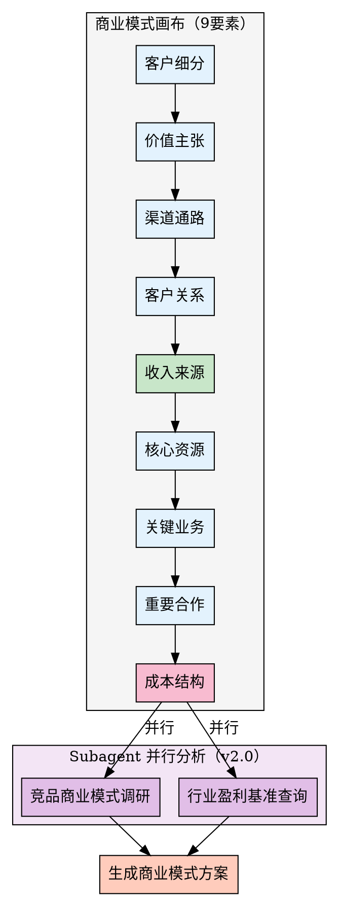

## Preamble (run first)

```bash
bash "$(dirname "${BASH_SOURCE[0]}")"/check-update.sh 2>/dev/null || true
# 创建目录
mkdir -p docs/05-产品战略

# 检查是否有PRD作为输入
if [ -f "docs/02-方案设计/PRD产品需求文档.md" ]; then
  echo "✅ 检测到PRD文档，将基于此设计商业模式"
fi
```

---

## 执行流程



### 步骤 1: 商业模式画布（9要素）

使用 AskUserQuestion 逐个询问商业模式画布的9个要素：

---

**要素 1: 客户细分（Customer Segments）**

使用 AskUserQuestion 询问：

> 请问您的目标客户是谁？

A) 大众市场（面向所有用户）
B) 利基市场（特定细分人群）
C) 多边市场（连接多个用户群体）
D) 分割市场（多个细分人群）
E) 其他（请手动输入）

继续询问：
> 请详细描述您的核心客户群体（年龄、地域、行为特征等）

---

**要素 2: 价值主张（Value Propositions）**

询问：

> 您的产品为客户解决什么核心问题？提供什么独特价值？

引导用户输入：
- 解决的核心痛点
- 独特的价值点
- 与竞品的差异化

---

**要素 3: 渠道通路（Channels）**

询问：

> 您通过什么渠道触达客户？（可多选）

A) 线上渠道（官网、APP、小程序）
B) 社交媒体（微信、抖音、小红书）
C) 线下渠道（门店、地推）
D) 合作伙伴渠道
E) 其他（请手动输入）

---

**要素 4: 客户关系（Customer Relationships）**

询问：

> 您与客户建立什么样的关系？

A) 自助服务（用户自助完成）
B) 专用个人助理（一对一服务）
C) 社区运营（用户社群）
D) 共同创造（用户参与产品设计）
E) 自动化服务（AI客服、智能推荐）

---

**要素 5: 收入来源（Revenue Streams）**

询问：

> 您的产品通过什么方式盈利？（可多选）

A) 销售商品收入
B) 订阅/会员收入
C) 广告收入
D) 交易佣金
E) 数据服务收入
F) 增值服务收入
G) 其他（请手动输入）

---

**要素 6: 核心资源（Key Resources）**

询问：

> 实现商业模式需要哪些核心资源？（可多选）

A) 实体资源（仓库、设备、门店）
B) 知识产权（专利、技术、品牌）
C) 人力资源（核心技术团队）
D) 金融资源（资金、投资）
E) 数据资源（用户数据、行为数据）

---

**要素 7: 关键业务（Key Activities）**

询问：

> 需要开展哪些关键业务？（可多选）

A) 产品研发
B) 用户运营
C) 市场营销
D) 供应链管理
E) 客户服务

---

**要素 8: 重要伙伴（Key Partnerships）**

询问：

> 需要哪些重要合作伙伴？（可多选）

A) 供应商
B) 分销渠道
C) 技术服务商
D) 物流合作伙伴
E) 战略投资方

---

**要素 9: 成本结构（Cost Structure）**

询问：

> 主要成本结构是什么？（可多选）

A) 固定成本（租金、人力、设备）
B) 变动成本（原材料、物流、营销）
C) 规模经济（规模越大成本越低）
D) 范围经济（多元化降低成本）

---

### 步骤 2: 收入模型设计

根据步骤1的收入来源，设计详细的收入模型：

---

**场景A: 订阅/会员收入**

询问：

> 会员模式设计

A) 单一会员（免费/付费二元）
B) 多级会员（基础/标准/高级）
C) 分层会员（按功能/按时长）
D) 其他（请手动设计）

继续询问会员定价：

> 会员定价策略

引导用户输入：
- 月费/年费价格
- 不同级别的功能差异
- 定价依据（成本加成/价值定价/竞争定价）

---

**场景B: 交易佣金**

询问：

> 佣金模式设计

引导用户输入：
- 佣金比例（如5%、10%）
- 计算方式（按交易额/按订单数）
- 分级佣金（大额交易优惠）

---

**场景C: 广告收入**

询问：

> 广告模式设计

A) 展示广告（按展示量计费CPM）
B) 点击广告（按点击量计费CPC）
C) 转化广告（按转化量计费CPA）
D) 品牌广告（按时间段计费CPT）

---

### 步骤 3: 定价策略

询问：

> 定价策略选择

A) 成本加成定价（成本+利润）
B) 价值定价（基于客户感知价值）
C) 竞争定价（参考竞品价格）
D) 渗透定价（低价快速占领市场）
E) 撇脂定价（高价收割高端用户）

继续询问具体价格：

> 具体定价方案

引导用户输入：
- 基础版价格
- 高级版价格
- 企业版价格
- 价格梯度设计逻辑

---

### 步骤 4: 成本结构分析

根据步骤1的成本结构，进行详细分析：

询问：

> 主要成本项目及占比

引导用户输入：
- 人力成本：X%
- 市场营销：X%
- 技术研发：X%
- 运营成本：X%
- 其他成本：X%

询问：

> 盈亏平衡点

> 多少用户/收入能达到盈亏平衡？

---

### 步骤 5: 生成商业模式设计文档

使用 Write 工具生成文档到 `docs/05-产品战略/商业模式设计.md`：

```markdown
---
product: [产品名称]
version: 1.0
created_at: [当前时间]
author: [用户]
skill: pm-business-model
status: draft
---

# 商业模式设计

## 一、商业模式画布

### 1. 客户细分

**目标客户**：[客户描述]

**核心特征**：
- 年龄：[X-X岁]
- 地域：[城市/地区]
- 行为特征：[描述]
- 痛点：[核心痛点]

---

### 2. 价值主张

**核心价值**：
1. [价值点1]
2. [价值点2]
3. [价值点3]

**差异化优势**：
- 与竞品A对比：[差异化点]
- 与竞品B对比：[差异化点]

---

### 3. 渠道通路

**主要渠道**：
1. [渠道1] - 占比[X]%
2. [渠道2] - 占比[X]%
3. [渠道3] - 占比[X]%

---

### 4. 客户关系

**关系类型**：[自助服务/个人助理/社区运营...]

**关键举措**：
- [举措1]
- [举措2]
- [举措3]

---

### 5. 收入来源

**收入结构**：

| 收入类型 | 占比 | 说明 |
|---------|------|------|
| [会员收入] | [60%] | 主要收入来源 |
| [广告收入] | [30%] | 次要收入 |
| [增值服务] | [10%] | 补充收入 |

**月度目标收入**：[X]万元

---

### 6. 核心资源

**关键资源**：
1. [技术平台] - 核心技术基础设施
2. [用户数据] - 用户行为数据资产
3. [品牌资产] - 品牌知名度
4. [核心团队] - 关键人才

---

### 7. 关键业务

**核心业务**：
1. 产品研发 - 持续迭代产品功能
2. 用户运营 - 提升用户活跃度和留存
3. 市场营销 - 获取新用户

---

### 8. 重要伙伴

**战略伙伴**：
1. [伙伴A] - [合作内容]
2. [伙伴B] - [合作内容]
3. [伙伴C] - [合作内容]

---

### 9. 成本结构

**成本构成**：

| 成本类型 | 占比 | 金额（月） | 说明 |
|---------|------|-----------|------|
| 人力成本 | [50%] | [X万] | 研发、运营团队 |
| 市场营销 | [25%] | [X万] | 获客、品牌推广 |
| 技术成本 | [15%] | [X万] | 服务器、云服务 |
| 运营成本 | [10%] | [X万] | 客服、物流 |

**月度总成本**：[X]万元

---

## 二、收入模型设计

### 模式1: 会员订阅

**会员等级**：

| 等级 | 价格 | 功能权益 | 目标用户 |
|------|------|---------|---------|
| 免费版 | 0元 | 基础功能 | 体验用户 |
| 标准版 | [X]元/月 | 标准功能 | 主流用户 |
| 高级版 | [X]元/月 | 高级功能 | 高价值用户 |
| 企业版 | [X]元/年 | 全部功能+专属服务 | 企业客户 |

**会员转化率目标**：
- 免费转付费：[X]%
- 标准转高级：[X]%

---

### 模式2: 交易佣金

**佣金规则**：
- 普通商品：佣金[X]%
- 高价值商品：佣金[X]%
- 大额交易（>[X]元）：佣金优惠至[X]%

**预估收入**：
- 月订单量：[X]万单
- 平均客单价：[X]元
- 月佣金收入：[X]万元

---

### 模式3: 广告收入

**广告类型**：
1. 开屏广告：[X]元/天
2. 信息流广告：[X]元/千次展示
3. 搜索广告：[X]元/点击

**预估收入**：
- DAU：[X]万
- 广告填充率：[X]%
- 月广告收入：[X]万元

---

## 三、定价策略

### 定价方法

**采用策略**：价值定价 + 竞争定价

**定价依据**：
1. 客户感知价值：[X]元/月
2. 竞品价格：[竞品A: X元, 竞品B: X元]
3. 成本支撑：最低[X]元/月能覆盖成本

---

### 具体定价方案

**标准版定价**：[X]元/月

**价格梯度**：
- 月付：[X]元/月
- 季付：[X]元/季（相当于[X]元/月，优惠[X]%）
- 年付：[X]元/年（相当于[X]元/月，优惠[X]%）

**定价心理学应用**：
- 锚定效应：展示原价[X]元，现价[X]元
- 诱饵效应：设置中间价位引导选择高级版
- 稀缺性：限时优惠制造紧迫感

---

## 四、盈利预测

### 收入预测（未来12个月）

| 月份 | 用户数 | 付费用户 | 收入（万元） | 增长率 |
|------|-------|---------|------------|--------|
| M1 | [X]万 | [X]千 | [X] | - |
| M3 | [X]万 | [X]千 | [X] | [X]% |
| M6 | [X]万 | [X]千 | [X] | [X]% |
| M12 | [X]万 | [X]万 | [X] | [X]% |

---

### 盈亏平衡分析

**盈亏平衡点**：
- 月固定成本：[X]万元
- 单用户贡献：[X]元
- 盈亏平衡用户数：[X]万用户

**预计达到时间**：M[X]

---

### 利润预测

| 阶段 | 时间 | 月收入 | 月成本 | 月利润 | 利润率 |
|------|------|-------|-------|-------|--------|
| 投入期 | M1-M6 | [X]万 | [X]万 | [-X]万 | [-X]% |
| 成长期 | M7-M12 | [X]万 | [X]万 | [X]万 | [X]% |
| 成熟期 | M13+ | [X]万 | [X]万 | [X]万 | [X]% |

---

## 五、风险评估

### 风险1: 用户增长不及预期

**影响**：收入无法覆盖成本
**概率**：中
**应对**：
1. 加大市场投放
2. 优化产品体验
3. 降低运营成本

---

### 风险2: 付费转化率低

**影响**：收入目标无法达成
**概率**：高
**应对**：
1. 优化会员权益
2. 提供免费试用
3. 推出优惠活动

---

### 风险3: 竞品价格战

**影响**：价格优势丧失
**概率**：中
**应对**：
1. 差异化竞争
2. 提升服务价值
3. 避免恶性价格战

---

## 六、下一步建议

建议执行：
1. /pm-position - 完善产品定位方案
2. /pm-roadmap - 制定产品路线图
3. /pm-growth - 制定增长执行方案

---

**项目状态**: 商业模式设计完成
**生成时间**: [当前时间]
**生成工具**: super-pm v2.0.0
```

---

## Subagent 并行分析（v2.0 新增）

在商业模式画布要素收集完成后，可派发 subagent 并行进行外部调研：

**Agent 1: 竞品商业模式调研**
```
type: "general-purpose"
prompt: "调研同行业竞品的商业模式、盈利方式、定价策略，提供结构化对比..."
```

**Agent 2: 行业盈利基准查询**
```
type: "general-purpose"
prompt: "查询目标行业的平均利润率、付费转化率、客单价等基准数据..."
```

## V1 vs V2 对比

| 维度 | v1（串行） | v2（Subagent 并行） |
|------|-----------|-------------------|
| 竞品调研 | 手动搜索或跳过 | Subagent 并行搜索分析 |
| 行业基准 | 无系统数据支撑 | Subagent 自动获取基准 |
| Token 占用 | 搜索结果占主上下文 | Subagent 独立处理 |
| 执行效率 | 线性顺序 | 并行 2x 加速 |

---

## 注意事项

1. **市场验证**：商业模式设计后需进行市场验证
2. **灵活调整**：根据市场反馈及时调整定价和模式
3. **竞争分析**：持续关注竞品动态
4. **合规性**：确保商业模式符合法规要求

---

## 输出质量对比

**✅ Good 示例**：
```
- 有数据引用：「根据 Q4 数据，留存率从 35% 降至 28%」
- 有验证来源：「数据来源：Google Analytics, 2025-12-01」
- 有明确建议：「建议将新手引导步骤从 5 步减少至 3 步」
```

**❌ Bad 示例**：
```
- 模糊结论：「数据表明留存率有所下降」
- 无来源：「根据经验，这个功能很重要」
- 没有行动建议：「留存是个问题」
```

---

## 常见误区 / Red Flags — STOP

出现以下情况立即停止并回溯：

| 误区 | 正确做法 |
|------|---------|
| 使用"应该"、"大概"、"看起来"做结论 | 必须基于实际数据和验证 |
| 未运行检查就声称已完成 | 先验证，再陈述 |
| 因时间紧迫跳过关键步骤 | 没有例外，时间紧更要严格 |
| "这次应该没问题"的想法 | 每次都要重新验证 |

---

## 产出质量检查 / Verification Checklist

- [ ] 前置依赖已满足（输入文档/数据已收集）
- [ ] 核心步骤已全部执行
- [ ] 输出文档已生成到 `docs/` 目录
- [ ] 每个判断都有数据/证据支撑
- [ ] 已推荐 2-3 个后续 skill

> ⚠️ 任何一项未通过 → 补全后再标记完成。

---
