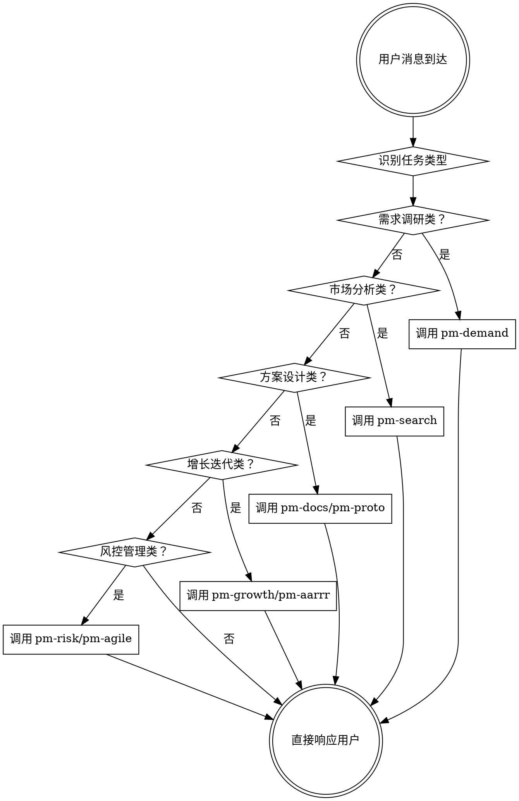

<EXTREMELY-IMPORTANT>
**自动触发原则：产品管理任务必须使用对应的 skill**

如果你认为某个产品管理 skill 有 1% 的可能性适用于当前任务，你**必须**调用该 skill。

**如果 PM skill 适用，你没有选择，必须使用它。**

这不可协商，不是可选项，你不能找借口跳过。
</EXTREMELY-IMPORTANT>

---

# Super-PM 自动触发系统

## 核心规则

**在任何产品管理相关的响应或行动之前，先检查并调用相关的 PM skill。**

即使只有 1% 的可能性 skill 适用，也应该先调用 skill 进行检查。如果调用的 skill 不适合当前情况，不需要使用它。

---

## 如何访问 PM Skills

**在 Claude Code：** 使用 `Skill` 工具。调用 skill 时，其内容会被加载并呈现给你——直接遵循它。不要使用 Read 工具读取 skill 文件。

**在其他环境：** 查看你平台的文档了解如何加载 skills。

---

## PM Skill 自动触发决策流程



---

## 任务类型识别指南

### 🎯 需求洞察模块（自动触发 pm-demand 或相关 skill）

**触发信号：**
- 用户提到"需求"、"用户痛点"、"用户场景"、"用户故事"
- 用户想了解"用户想要什么"、"解决什么问题"
- 用户在描述产品想法、功能设想
- 用户在收集用户反馈、用户调研
- 用户在规划用户旅程、用户画像

**自动调用的 Skills：**

| 任务描述 | 自动调用 Skill | 说明 |
|---------|---------------|------|
| "我想做一个产品"、"帮我想个产品创意" | `pm-demand` | 需求调研入口 |
| "分析一下用户痛点"、"用户调研怎么做" | `pm-demand` | 用户需求挖掘 |
| "看看市场情况"、"分析竞品" | `pm-search --type=competitor` | 竞品分析 |
| "查查行业数据"、"市场规模多大" | `pm-search --type=data` | 行业数据调研 |
| "这个需求优先级怎么排" | `pm-priority` | 优先级排序 |
| "规划 MVP"、"什么功能先做" | `pm-mvp` | MVP 规划 |
| "需求池怎么管理"、"需求太多" | `pm-pool` | 需求池管理 |
| "用户旅程是什么"、"用户体验路径" | `pm-journey` | 用户旅程地图 |

---

### 📄 方案落地模块（自动触发 pm-docs 或相关 skill）

**触发信号：**
- 用户要写"PRD"、"BRD"、"MRD"、"产品文档"
- 用户在做"原型设计"、"功能设计"
- 用户需要"技术对接"、"API 设计"
- 用户在拆解"功能细节"、"数据指标"
- 用户在做"产品定位"、"商业化方案"

**自动调用的 Skills：**

| 任务描述 | 自动调用 Skill | 说明 |
|---------|---------------|------|
| "写个 PRD"、"生成产品文档" | `pm-docs --type=prd` | PRD 文档生成 |
| "写个 BRD"、"商业需求文档" | `pm-docs --type=brd` | BRD 文档生成 |
| "设计原型"、"产品原型" | `pm-proto` | 原型设计 |
| "技术方案"、"开发对接" | `pm-tech` | 技术对接方案 |
| "功能拆解"、"详细设计" | `pm-feature` | 功能细节拆解 |
| "数据指标体系"、"埋点设计" | `pm-data` | 数据指标体系 |
| "产品定位"、"差异化竞争" | `pm-position` | 产品定位 |
| "商业化方案"、"赚钱模式" | `pm-commercial` | 商业化方案 |

---

### 📈 增长迭代模块（自动触发 pm-growth 或相关 skill）

**触发信号：**
- 用户提到"增长"、"AARRR"、"获客"、"留存"
- 用户在做"数据分析"、"周报"、"月报"
- 用户在分析"用户反馈"、"用户满意度"
- 用户要做"A/B 测试"、"实验"
- 用户在规划"迭代计划"、"复盘"、"路线图"

**自动调用的 Skills：**

| 任务描述 | 自动调用 Skill | 说明 |
|---------|---------------|------|
| "增长分析"、"AARRR 模型" | `pm-aarrr` | AARRR 增长分析 |
| "增长方案"、"怎么拉新" | `pm-growth` | 增长执行方案 |
| "写周报"、"数据报告" | `pm-report` | 数据报告生成 |
| "用户反馈分析"、"用户意见" | `pm-feedback` | 用户反馈分析 |
| "A/B 测试方案"、"实验设计" | `pm-abtest` | A/B 测试方案 |
| "迭代计划"、"下个版本做什么" | `pm-iteration` | 迭代计划 |
| "复盘"、"回顾总结" | `pm-retro` | 迭代复盘 |
| "产品路线图"、"长期规划" | `pm-roadmap` | 产品路线图 |

---

### 🛡️ 风控管理模块（自动触发 pm-risk 或相关 skill）

**触发信号：**
- 用户在做"项目管理"、"敏捷开发"
- 用户需要"跨部门协作"、"沟通协调"
- 用户在识别"风险"、"问题"、"隐患"
- 用户准备"上线"、"发布"
- 用户在处理"需求变更"、"迭代调整"

**自动调用的 Skills：**

| 任务描述 | 自动调用 Skill | 说明 |
|---------|---------------|------|
| "敏捷管理"、"Scrum"、"看板" | `pm-agile` | 敏捷管理方案 |
| "跨部门协作"、"沟通问题" | `pm-cross` | 跨部门协作 |
| "风险识别"、"风险管理" | `pm-risk` | 风险管控 |
| "上线方案"、"发布计划" | `pm-release` | 上线执行方案 |
| "需求变更"、"需求调整" | `pm-change` | 需求变更管理 |

---

## ⚠️ 红色警报：这些想法意味着你在找借口跳过 skill

| 想法 | 现实 |
|------|------|
| "这只是简单的需求描述" | **需求描述也需要深度调研**，应该用 `pm-demand` |
| "我直接写文档就行" | **文档需要结构化方法**，应该用 `pm-docs` |
| "这个需求很明确" | **明确的需求也需要验证**，应该用 `pm-demand` 验证 |
| "只是看看市场数据" | **市场数据需要系统收集**，应该用 `pm-search` |
| "我知道用户想要什么" | **你的假设需要验证**，应该用 `pm-demand` 调研 |
| "功能很简单，不用拆解" | **简单功能也需要详细设计**，应该用 `pm-feature` |
| "MVP 就是核心功能" | **MVP 需要系统规划**，应该用 `pm-mvp` |
| "优先级看业务价值就行" | **优先级需要多维评估**，应该用 `pm-priority` |
| "增长就是拉新" | **增长需要全链路分析**，应该用 `pm-aarrr` |
| "风险可控" | **风险需要系统识别**，应该用 `pm-risk` |
| "这只是个小需求变更" | **小变更也需要管理**，应该用 `pm-change` |
| "我会自己判断" | **判断需要方法论支撑**，应该用对应 skill |

---

## Skill 优先级规则

当多个 skills 可能适用时，按以下顺序：

1. **流程型 skills 优先**（brainstorming、pm-demand、pm-clarify）
   - 这些决定**如何**开始任务

2. **执行型 skills 其次**（pm-docs、pm-proto、pm-tech）
   - 这些指导**具体执行**

3. **分析型 skills 补充**（pm-search、pm-aarrr、pm-report）
   - 这些提供**数据支持**

**示例：**
- "我要做一个电商小程序" → 先 `pm-demand`（调研需求），再 `pm-search`（市场分析）
- "写个 PRD" → 直接 `pm-docs --type=prd`
- "怎么提升留存" → 先 `pm-aarrr`（分析现状），再 `pm-growth`（制定方案）

---

## Skill 类型分类

### 刚性 Skill（必须严格遵循）
- **pm-priority** - 优先级排序方法必须按流程执行
- **pm-mvp** - MVP 规划需要完整步骤
- **pm-risk** - 风险管控需要系统化流程
- **pm-abtest** - A/B 测试需要严谨设计

### 灵活 Skill（可根据场景调整）
- **pm-demand** - 需求调研可根据项目调整深度
- **pm-docs** - 文档格式可根据团队规范调整
- **pm-growth** - 增长方案可根据资源调整

**skill 本身会告诉你属于哪种类型。**

---

## 用户指令解析

用户说的"做什么"（WHAT），不代表可以跳过"怎么做"（HOW）。

**示例：**

| 用户说 | 你的理解 | 必须调用的 Skill |
|--------|---------|----------------|
| "帮我做个需求调研" | 用户要执行需求调研流程 | `pm-demand` |
| "写个 PRD" | 用户要生成 PRD 文档 | `pm-docs --type=prd` |
| "分析一下竞品" | 用户要做竞品分析 | `pm-search --type=competitor` |
| "排个优先级" | 用户要排需求优先级 | `pm-priority` |
| "规划一下 MVP" | 用户要做 MVP 规划 | `pm-mvp` |
| "做个增长方案" | 用户要制定增长策略 | `pm-growth` |
| "识别一下风险" | 用户要做风险管理 | `pm-risk` |

---

## 典型 PM 工作流示例

### 场景 1：新产品从 0 到 1

```
用户：我想做一个生鲜电商小程序

AI 自动触发：
1. 识别到需求调研类任务 → 调用 pm-demand
2. pm-demand 执行需求调研 → 生成需求调研报告
3. 推荐：pm-search（市场分析）→ pm-priority（优先级）→ pm-mvp（MVP 规划）
```

### 场景 2：已有产品的功能迭代

```
用户：用户反馈搜索功能不好用，需要优化

AI 自动触发：
1. 识别到用户反馈分析 → 调用 pm-feedback
2. pm-feedback 分析反馈 → 生成优化建议
3. 推荐：pm-priority（排优先级）→ pm-feature（功能设计）→ pm-docs（写 PRD）
```

### 场景 3：增长遇到瓶颈

```
用户：我们的日活一直在下降，怎么办？

AI 自动触发：
1. 识别到增长问题 → 调用 pm-aarrr
2. pm-aarrr 分析各环节数据 → 识别问题环节
3. 推荐：pm-growth（制定增长方案）→ pm-abtest（设计实验）
```

### 场景 4：准备上线发布

```
用户：新功能开发完了，准备上线

AI 自动触发：
1. 识别到上线任务 → 调用 pm-release
2. pm-release 制定上线方案 → 生成检查清单
3. 推荐：pm-risk（风险识别）→ pm-agile（迭代管理）
```

---

## 跨会话延续机制

### 如果用户说"继续上次的工作"

1. **检查 `docs/` 目录**，识别上次生成的文档
2. **识别当前阶段**，判断下一步应该调用哪个 skill
3. **自动触发对应的 skill**，继续工作流

**示例：**

```
用户：继续上次的需求调研

AI 行为：
1. 读取 docs/01-需求调研/需求调研报告.md
2. 识别当前进度（需求调研已完成）
3. 推荐下一步：pm-search（市场分析）或 pm-priority（优先级排序）
4. 等待用户确认后执行
```

---

## 技能包状态追踪

Super-PM 会自动追踪项目状态：

**检查文件：**
- `docs/01-需求调研/` - 需求洞察阶段产物
- `docs/02-方案设计/` - 方案落地阶段产物
- `docs/03-增长迭代/` - 增长迭代阶段产物
- `docs/04-风控管理/` - 风控管理阶段产物

**自动判断：**
- 如果某阶段文档缺失 → 提示用户补全
- 如果文档已存在 → 基于现有文档继续
- 如果文档过时 → 提示用户更新

---

## 主动推荐机制

在完成一个 skill 执行后，**主动推荐下一步**：

**格式：**

```
✅ 需求调研已完成

📊 已生成文档：
- docs/01-需求调研/需求调研报告.md

💡 建议下一步：
1. 执行 /pm-search --type=market 进行市场调研（推荐）
2. 执行 /pm-priority 进行优先级排序
3. 执行 /pm-mvp 规划 MVP 方案

请问您想继续哪一步？
```

---

## 总结：Super-PM 的核心价值

### 🎯 自动化 PM 工作流

- **自动识别任务类型** → 无需用户记住 skill 名称
- **自动调用对应 skill** → 方法论自动应用
- **自动生成专业文档** → 标准化输出
- **自动推荐下一步** → 工作流持续推进

### 🚀 核心优势

1. **降低认知负担** - PM 不需要记住所有方法论
2. **保证工作质量** - 每个 skill 都是经过验证的最佳实践
3. **提高工作效率** - 自动化流程，减少重复劳动
4. **知识沉淀** - 所有输出文档化，便于传承

### 💡 核心理念

**让每个产品经理都能拥有完整的产品团队的能力。**

通过 Super-PM，一个 PM 可以：
- 像有用户研究员一样深度洞察需求
- 像有数据分析师一样科学分析数据
- 像有项目经理一样系统管理风险
- 像有增长专家一样设计增长策略

**Super-PM = 你的全能产品团队助手** 🚀

---

## 快速开始示例

**用户：** 我想做一个在线教育产品

**AI 自动执行：**
```
🎯 识别到需求调研类任务
📚 自动调用 skill: pm-demand

[执行 pm-demand skill...]

✅ 需求调研完成！

📄 已生成文档：
- docs/01-需求调研/需求调研报告.md

💡 建议下一步：
1. /pm-search --type=market - 市场调研分析
2. /pm-search --type=competitor - 竞品分析
3. /pm-priority - 需求优先级排序

请问您想继续哪一步？
```

---

**Super-PM - 让产品管理更专业、更高效、更系统** ✨